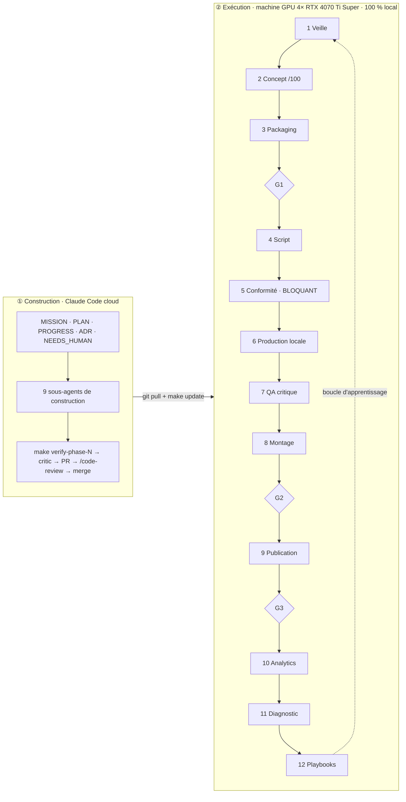

# Décisions d'architecture (ADR)

Format imposé (contrôlé par `make verify-phase-0`) : `## ADR-NNN — Titre`, puis `### Statut`, `### Contexte`,
`### Options`, `### Décision`, `### Conséquences`, `### Coût d'un retour arrière`, `### Sources`.
Les faits externes renvoient aux notes de `docs/research/` sous la forme `note.md [Sn]`.

## Index

| ADR | Sujet | Statut |
|---|---|---|
| ADR-001 | Architecture : deux plans, planificateur adressé par contenu, file Postgres, un worker par GPU | accepté |
| ADR-002 | Stratégie fournisseurs : modèles locaux, politique de licences, shortlist du benchmark | accepté |
| ADR-003 | Corrections proposées à MISSION §0, §4, §5, §6, §8 après la phase 0 | proposé (accord humain requis) |
| ADR-004 | Preuve de demande : mesure des outliers par l'API officielle uniquement | accepté |

---

## ADR-001 — Architecture : deux plans, planificateur adressé par contenu, file Postgres, un worker par GPU

### Statut
Accepté le 2026-09-28 (phase 0). À réexaminer à la fin de la phase 1 si `make e2e-dry` ou les tests de reprise contredisent une hypothèse ci-dessous.

### Contexte
Contraintes qui dimensionnent le système :
1. **Charge faible.** `docs/PARAMETERS.md` : 2 chaînes × (1 long + 3 Shorts) par semaine au lancement ; « des dizaines de chaînes » à terme, soit au plus quelques centaines de vidéos par semaine et quelques milliers de tâches par jour. Une machine d'exécution et une base suffisent ; un système distribué n'apporterait que de la complexité.
2. **Ressources rares : heures GPU, quota Claude, temps humain.** Une relance ne doit jamais repayer un plan déjà généré ni un appel Claude déjà fait (MISSION §6.1).
3. **Matériel fragmenté.** 4 cartes de 16 Go sans NVLink : 4 espaces VRAM indépendants ; charger un modèle coûte des dizaines de secondes ; OOM et blocages sont des cas normaux, pas des exceptions.
4. **Un humain, ≤ 30 min par jour.** Chaque service de plus est un service à surveiller : l'exploitation doit tenir en `make up` / `make update`.
5. **Conformité non contournable.** Une sanction pour spam ou contournement vise le titulaire et peut toucher toutes ses chaînes (`platform-policies.md` [S1]).
6. **Deux environnements.** La VM cloud qui construit n'a pas de GPU ; la machine GPU exécute.
7. **Dépôt public** (NEEDS_HUMAN H1) : ce qui transite par git est public ; les règles de l'API YouTube limitent aussi la conservation des données (`apis.md`).
8. **Aucun orchestrateur du marché ne fournit** l'affinité GPU, la préemption des brouillons et les plafonds de coût : ces trois fonctions sont à écrire quel que soit l'outil (`infra.md` [S1][S3][S23]).

Schéma de référence (fourni par l'humain le 2026-09-28) :

### Options
**A. Orchestrateur**

| Option | Pour | Contre |
|---|---|---|
| A1. Service dédié (Temporal, Hatchet, Prefect, Dagster) | reprise, UI, planification fournies | un ou plusieurs services avec état propre à exploiter ; affinité GPU, préemption et plafonds restent à écrire ; retour arrière élevé pour Temporal et Dagster (`infra.md` tableau comparatif) |
| A2. Bibliothèque d'exécution durable sur Postgres (DBOS Transact, MIT) | aucun service de plus ; reprise et cron intégrés (`infra.md` [S1][S2]) | second modèle d'état (tables de workflow DBOS) en plus de l'index d'artefacts ; contraintes de déterminisme des workflows ; routage vers une carte précise et préemption non confirmés dans la doc |
| A3. File de tâches bibliothèque (Procrastinate, PgQueuer, MIT) | simple, Postgres seul (`infra.md` [S23][S25]) | priorités et routage partiels ; préemption à écrire |
| A4. **Planificateur maison adressé par contenu + file Postgres maison (`FOR UPDATE SKIP LOCKED`, baux)** | la reprise découle des données : un artefact existe ou non ; une seule source de vérité (Postgres) ; affinité, préemption et plafonds écrits une fois, au bon endroit | concurrence et baux à tester nous-mêmes (motif standard, volume faible) |

**B. Stockage des médias** : B1 disque local adressé par hash + index Postgres ; B2 stockage objet S3 local (MinIO exclu : édition libre en fin de vie, dépôt archivé le 25/04/2026, `infra.md` [S30] ; SeaweedFS Apache-2.0 possible, `infra.md` [S35]).

**C. OS de la machine GPU** : C1 Ubuntu 24.04 natif ; C2 Windows + WSL2 (Docker n'y filtre pas un GPU par index, seul `--gpus all` fonctionne : incompatible avec un worker par carte, `infra.md` [S39]).

**D. Où tournent les agents Claude** : D1 `claude -p` sur la machine d'exécution ; D2 routines Claude Code planifiées dans le cloud qui poussent leurs sorties dans le dépôt.

### Décision
1. **Deux plans.** Construction = ce dépôt + CI GitHub Actions (mocks et fixtures seulement, pas de GPU : `infra.md` [S45]). Exécution = machine GPU sous **Ubuntu 24.04 natif** (C1), Docker Compose + NVIDIA Container Toolkit (`infra.md` [S37][S38]). Mise à jour : `git pull && make update` (build, migrations, redémarrage).
2. **Planificateur adressé par contenu (A4).** Chaque vidéo est une cible ; le planificateur déroule le graphe d'étapes (veille → … → publication → analytics). Clé d'une étape = SHA-256 de (contrats d'entrée canoniques, paramètres, version de l'étape, graine). Si l'artefact de sortie existe, l'étape est sautée. Reprise après crash = replanifier : rien n'est recalculé ni repayé. Les appels Claude et les générations stochastiques sont des étapes comme les autres (graine et prompt dans la clé).
3. **File Postgres maison.** Table `jobs` : priorité, classe de ressource (`gpu:16g`, `cpu`, `llm`, `human`), affinité de modèle, bail (`lease_until`) renouvelé par battement, tentatives bornées, état. Prise de tâche par `SELECT … FOR UPDATE SKIP LOCKED`. Interface `JobQueue` : Procrastinate est le plan B sans toucher aux étapes.
4. **Un worker par carte.** 4 services Compose épinglés par `device_ids` (`infra.md` [S38]), chacun avec son instance ComfyUI headless (`--cuda-device`, `--port`, API `/prompt` + websocket, `infra.md` [S40][S41]) ou un runtime diffusers selon l'adaptateur (ADR-002). L'ordonnanceur préfère les tâches du modèle déjà chargé (affinité), sert les finaux avant les brouillons et ne démarre plus de brouillon quand un final attend (préemption coopérative : les brouillons sont courts ; une annulation dure reste possible).
5. **Plafonds avant exécution.** Le registre des coûts (GPU-s, kWh estimés, jetons et durée Claude, minutes humaines) est vérifié **avant** la prise d'une tâche : un dépassement du plafond par vidéo, par jour ou par mois bloque la file de la vidéo concernée et crée une alerte (valeurs dans `docs/COST_MODEL.md`).
6. **Stockage (B1).** Disque local `/var/studio/cas/aa/bbbb…` + index Postgres (hash, type, taille, étape productrice, coût, date, compteur de références). Rétention configurable ; les masters publiés et la base sont sauvegardés. Plan B : SeaweedFS derrière la même interface `ArtifactStore`.
7. **Agents Claude (D1).** Chaque agent runtime est un sous-agent versionné dans `studio/.claude/agents/`, appelé par `ClaudeCodeRunner` : `claude -p --output-format json --json-schema <schéma> --model <m> --max-turns <n>` avec des outils autorisés minimaux ; **jamais `--bare`** (ce mode n'utilise pas l'authentification de l'abonnement, `apis.md`) ; `make doctor` échoue si `ANTHROPIC_API_KEY` existe (elle prendrait le pas sur l'abonnement, `apis.md`). Un gestionnaire de quota mesure l'usage de chaque appel (champs d'usage de la sortie JSON), sert les priorités conformité et scripts > critique > veille, détecte la limite atteinte, met la file `llm` en pause et reprend à la réinitialisation. Les routines cloud (D2) sont écartées pour l'instant : elles pousseraient idées et scripts dans un dépôt public et dispersent la mesure du quota.
8. **Conformité câblée dans le graphe.** L'étape de publication prend en entrée le verdict `compliance_officer` calculé sur le hash exact du rendu final. Aucun paramètre ni drapeau ne permet de publier sans verdict favorable ; un test de phase 1 le vérifie.
9. **Portes humaines.** Une porte est une étape de classe `human` : elle attend un artefact « décision » (agent + humain) produit par l'interface de validation (FastAPI + HTMX, licences MIT et 0BSD, `infra.md` [S55][S56]) accessible sur le réseau privé (Tailscale Personal ou WireGuard, `infra.md` [S42]). Les notifications passent par n8n sur le mini-PC (licence Sustainable Use, usage interne autorisé, `infra.md` [S43]).
10. **Observabilité.** Manifeste JSON par vidéo (clés d'artefacts, coûts, décisions, versions), logs JSON structurés sans secret, tableau de bord dans la même application FastAPI.
11. **Multi-chaînes.** Une chaîne = un fichier de configuration (bible, langue, voix, style, watchlist) ; aucun code propre à une chaîne.

### Conséquences
- Phase 1 écrit : contrats Pydantic, calcul de clé canonique, `ArtifactStore`, `JobQueue` (+ tests de concurrence et de reprise : un worker tué en plein bail voit sa tâche reprise sans doublon d'artefact), ordonnanceur simulé à 4 workers mock, registre des coûts, `ClaudeCodeRunner` + mock, CLI.
- Les tests d'intégration Postgres tournent en CI dans un conteneur de service ; les tests unitaires utilisent une implémentation en mémoire de `JobQueue` au même contrat.
- La VM cloud ne voit jamais de GPU : tout adaptateur a un mock nommé `mock` ; la vérité GPU vient de `make gpu-smoke`.
- Aucune donnée d'analytics ni de chaîne ne transite par le dépôt tant qu'il est public.

### Coût d'un retour arrière
- Orchestrateur : faible. Les étapes ne dépendent que des interfaces `JobQueue` et `ArtifactStore` ; passer à Procrastinate ou DBOS remplace ≈ 1 module, sans migration de médias.
- Stockage : faible. Les noms de fichiers sont des hash ; passer à S3 local = nouvelle implémentation d'`ArtifactStore` + copie.
- OS : moyen. Passer à WSL2 casserait l'épinglage par carte ; il faudrait un seul worker multi-GPU.
- Agents dans le cloud : faible. `ClaudeCodeRunner` est derrière une interface ; un backend « routine » s'ajoute par configuration.

### Sources
`infra.md` [S1] [S2] [S3] [S23] [S25] [S30] [S35] [S37] [S38] [S39] [S40] [S41] [S42] [S43] [S45] [S55] [S56] · `apis.md` (sections « Conséquences d'architecture » et « État de l'usage de claude -p sur abonnement ») · `platform-policies.md` [S1].

---

## ADR-002 — Stratégie fournisseurs : modèles locaux, politique de licences, shortlist du benchmark

### Statut
Accepté le 2026-09-28. La shortlist est une hypothèse : `make bench-models` (phase 3) la confirme ou la remplace par un nouvel ADR.

### Contexte
- Règle dure (MISSION §5) : pixels et sons viennent de modèles à poids ouverts exécutés sur la machine GPU ou de code de rendu ; Claude, via Claude Code, est le seul service distant de création.
- Opérateur en France : une licence qui exclut l'UE est éliminatoire ; l'usage est commercial (monétisation).
- Contrainte matérielle : 16 Go par carte, Ada sm_89 (FP8 natif d'après la note ; FP4 natif documenté seulement pour la 5ᵉ génération de Tensor Cores, `video-image-models.md` [S46]).
- Aucun chiffre de VRAM ou de vitesse n'a été mesuré sur RTX 4070 Ti Super : les chiffres publiés viennent de RTX 4090 ou de GPU de centre de données (`video-image-models.md`, questions ouvertes).

### Options
1. **Un seul modèle vidéo** (Wan 2.2) : simple, mais aucune alternative si un défaut systématique apparaît.
2. **Routeur multi-modèles locaux + rendu procédural majoritaire** : chaque plan va à la technique la moins chère qui atteint la barre de qualité (MISSION §6.6).
3. **Accepter des licences à zone grise** (FLUX.1 [dev], CogVideoX, Hunyuan) pour gagner en qualité : risque juridique sur des revenus et exclusion UE explicite pour Hunyuan.

### Décision
**Option 2**, avec la politique de licences suivante.

| Classe | Règle | Exemples (vérifiés dans les fichiers de licence) |
|---|---|---|
| Acceptée | Apache-2.0, MIT, BSD, CC0, CC-BY (poids et sorties) | Wan 2.2 (`video-image-models.md` [S2][S3]), Qwen-Image / Qwen-Image-Edit, Z-Image, FLUX.1 [schnell], SeedVR2, RIFE ; Qwen3-TTS, Kokoro, Chatterbox, CosyVoice ; faster-whisper, Whisper (`audio-models.md`) |
| Sous condition | licence communautaire à seuil de revenu, sans exclusion territoriale : acceptée tant que le seuil est loin, avec un suivi dans le registre des modèles | LTX-2 (gratuit sous 10 M$ de revenu annuel, `video-image-models.md` [S7]) |
| Refusée | non commerciale (NC), exclusion de l'UE, enregistrement obligatoire sous droit étranger avec plafond de trafic, dépendance non commerciale | HunyuanVideo 1.5 / HunyuanImage / FramePack (UE exclue, [S9]) ; FLUX.1 [dev], Kontext [dev], FLUX.2 [dev] (modèle non commercial, [S22][S23]) ; CogVideoX 1.5 ([S18]) ; GIMM-VFI ([S37]) ; InstantID et IP-Adapter-FaceID (InsightFace non commercial, [S31][S32]) ; F5-TTS, XTTS-v2, Fish-Speech, MusicGen, MMAudio, HunyuanVideo-Foley (`audio-models.md`) |
| Hors règle | poids fermés, même exécutés localement | Topaz et logiciels propriétaires équivalents ; Wan 2.5 / 2.6 / 2.7 / 3.0 (API seulement, [S1][S4]) |

**Shortlist du benchmark** (`video-image-models.md` §8, `audio-models.md`) :
- Vidéo : Wan 2.2 TI2V-5B (référence dense) ; Wan 2.2 I2V-A14B + LoRA de distillation lightx2v (brouillons rapides, finaux avec offload ou multi-GPU) ; LTX-2 (audio natif), sous condition.
- Image : Z-Image Turbo (principal) ; Qwen-Image-Edit (édition, cohérence d'identité).
- Upscaling : SeedVR2 ; interpolation : RIFE.
- Identité (si un personnage récurrent est indispensable) : LoRA de personnage entraînée localement ; PuLID ; jamais InstantID.
- Voix : Qwen3-TTS (narrateur) ; Chatterbox ou CosyVoice en secours ; Kokoro en secours léger ; contrôle par faster-whisper large-v3.
- Musique : composition procédurale (MIDI + FluidSynth + SoundFonts à licence vérifiée) par défaut ; ACE-Step / YuE / DiffRhythm en complément génératif ; pistes à licence documentée.
- Effets sonores : banques CC0 (Freesound filtré) et Sonniss (licence commerciale libre de droits) ; aucun modèle génératif retenu (tous NC ou exclus).
- Rendu : Blender headless (Cycles OptiX / EEVEE) + assets CC0 (Poly Haven, ambientCG) ; Remotion (gratuit jusqu'à 3 salariés, `infra.md` [S44]) ; ffmpeg + NVENC.
- Marquage : C2PA (c2pa-python, Apache-2.0/MIT) + IPTC `digitalSourceType` (`trainedAlgorithmicMedia`, `compositeSynthetic`) écrits à l'export (`video-image-models.md` [S47][S48][S49]).

**Registre des modèles** (`studio/models.yaml`, phase 1) : pour chaque modèle, révision épinglée (commit Hugging Face), URL et SHA-256 du fichier LICENSE à cette révision, classe de licence, VRAM mesurée, GPU-s par seconde produite mesurés, statut (`candidat`, `retenu`, `écarté` + raison). Un test compare le hash de licence enregistré à celui de la révision épinglée : un changement de licence bloque l'adaptateur.

### Conséquences
- La qualité se gagne par la grammaire de plans (procédural majoritaire, génératif réservé au mouvement vivant) et par la sélection brouillon → final, pas par un modèle unique.
- `make bench-models` mesure pour chaque candidat : VRAM de pointe, GPU-s par seconde produite, taux de défauts bloquants (`visual_critic`), préférence à l'aveugle (≥ 30 votes par série).
- Les visages humains en gros plan restent évités ; s'ils sont indispensables, ils passent par la chaîne identité ci-dessus et une divulgation.

### Coût d'un retour arrière
Faible par modèle : chaque modèle est derrière un adaptateur au contrat commun, et le routeur choisit par configuration. Moyen pour la politique de licences : l'assouplir exigerait un avis juridique et l'accord écrit de l'humain (MISSION §5).

### Sources
`video-image-models.md` [S1] [S2] [S3] [S4] [S7] [S9] [S18] [S22] [S23] [S31] [S32] [S37] [S46] [S47] [S48] [S49] · `audio-models.md` (synthèse et table des licences) · `infra.md` [S44].

---

## ADR-003 — Corrections proposées à MISSION §0, §4, §5, §6, §8 après la phase 0

### Statut
Proposé le 2026-09-28. `docs/MISSION.md` reste inchangé tant que l'humain n'a pas validé (NEEDS_HUMAN). En attendant, le code suit la colonne « Correction ».

### Contexte
MISSION §3.6 : une source plus récente et mieux établie l'emporte, et l'écart est noté. La phase 0 a vérifié les affirmations du §4 et relevé les écarts suivants.

### Options
1. Appliquer les corrections dans `docs/MISSION.md` directement : interdit par la mission elle-même (« propose la correction par ADR au lieu de l'appliquer aveuglément »).
2. Tenir les corrections dans cet ADR et `docs/PARAMETERS.md`, faire valider par l'humain, puis ajouter un erratum daté en fin de `docs/MISSION.md`.

### Décision
Option 2. Corrections proposées :

| § | Affirmation de la mission | Constat (source) | Correction |
|---|---|---|---|
| §4 Modèles vidéo | « Wan 2.2 / 2.7 (Apache 2.0) » | seul Wan 2.2 est ouvert ; 2.5 → 3.0 sont fermés (`video-image-models.md` [S1][S4]) | « Wan 2.2 (Apache 2.0) ; les versions ultérieures sont fermées » |
| §4 Modèles vidéo | « LTX-2.x (licence à vérifier) » | licence communautaire, gratuite sous 10 M$ de revenu annuel (`video-image-models.md` [S7]) | classe « sous condition » (ADR-002) |
| §4 Modèles vidéo | « HunyuanVideo 1.5 (… à vérifier) » | licence excluant l'UE, confirmée dans le texte ([S9]) | refusé |
| §4 API YouTube | 100 `videos.insert` et 100 `search.list` par jour, 10 000 unités pour le reste | confirmé ; depuis le 01/06/2026 ces deux méthodes ont leur propre compteur (`apis.md`) | inchangé, précision ajoutée |
| §0 OS | « Ubuntu 24.04 / Windows + WSL2 » | WSL2 ne permet pas d'épingler un GPU par index (`infra.md` [S39]) | Ubuntu 24.04 natif requis |
| §5 Voix | « portage CUDA attendu » | Qwen3-TTS tourne nativement sur CUDA (transformers / vLLM, Apache-2.0, `audio-models.md`) | tâche = reproduire le timbre du narrateur et mesurer VRAM, vitesse et WER |
| §6 Claude | `--max-turns` | toujours documenté bien qu'absent de `claude --help` v2.1.283 ; `--bare` n'utilise jamais l'abonnement (`apis.md`) | ajouter « ne jamais utiliser `--bare` » |
| §8 Audio | « −14 LUFS ±1 » | aucune page officielle YouTube ou TikTok ne publie de cible ; consensus de praticiens (`audio-models.md`) | garder −14 LUFS ±1 comme cible interne, étiquetée « praticien, confiance moyenne » |
| §4 Monétisation | (absent) | au 01/02/2027 : nouvelles entrées YPP à 8 000 h ou 20 M de vues Shorts ; partage des revenus Shorts réservé aux chaînes à ≥ 10 M de vues Shorts sur 90 jours (blog YouTube du 10/08/2026, `economics.md` [S5]) | les Shorts d'une chaîne neuve servent à la découverte, pas au revenu ; le long format porte l'économie |
| §4 Monétisation TikTok | contenu entièrement IA exclu du Creator Rewards (confiance moyenne) | les conditions officielles ne le mentionnent pas ; seules des sources secondaires le disent (`platform-policies.md` [S18][S27]) | inchangé : aucune dépendance au programme |
| §7 | « aucun scraping contraire aux conditions » | vérifié : les pages YouTube ne sont pas une source légitime de mesure ; l'API officielle l'est (ADR-004) | inchangé |

### Conséquences
- `docs/PARAMETERS.md` passe l'OS à « Ubuntu 24.04 natif » (hypothèse renforcée par une contrainte technique).
- Le concept de chaîne et le calendrier tiennent compte des seuils YPP de 2027 (voir `docs/research/channel-concepts.md`).

### Coût d'un retour arrière
Nul : un erratum se retire ; aucun code ne dépend du texte de la mission.

### Sources
`video-image-models.md` [S1] [S4] [S7] [S9] · `apis.md` · `infra.md` [S39] · `audio-models.md` · `economics.md` [S5] · `platform-policies.md` [S18] [S27].

---

## ADR-004 — Preuve de demande : mesure des outliers par l'API officielle uniquement

### Statut
Accepté le 2026-09-28.

### Contexte
La phase 0 exige, pour chaque concept de chaîne, au moins 2 outliers récents (vues ≥ 3× la médiane de la chaîne). Pendant la recherche, les pages YouTube n'ont pas pu servir de source (blocage anti-robot, conditions d'utilisation qui interdisent l'accès automatisé) et les sites de statistiques tiers ont renvoyé 402/403/429 ou n'affichaient que quelques vidéos anciennes (`_work/concepts-a.md`, note méthodologique). La première version du vérificateur acceptait une simple URL de vidéo comme preuve : une preuve creuse.

### Options
1. Accepter des preuves indirectes (taille de chaîne, vues cumulées) : ne mesure pas un outlier.
2. Extraire les pages YouTube par script : contraire aux conditions de la plateforme et à MISSION §7 (`scout`) et §12.
3. **API YouTube Data v3 avec une clé en lecture seule** : données publiques, 1 unité de quota par appel, sans `search.list` (100 unités) (`apis.md`).

### Décision
Option 3. `tools/outliers.py` calcule ratio = vues ÷ médiane des 30 vidéos précédentes **du même format** (Short ≤ 180 s ou long) de la chaîne ; les vidéos plus anciennes ont eu au moins autant de temps pour accumuler des vues, donc le ratio est une borne basse. Pas de ratio pour une vidéo de moins de 7 jours. Le vérificateur ne compte qu'une ligne qui porte un ratio ≥ 3× et une date de publication de moins de 18 mois. Le même code sert de base à l'agent `scout` (watchlist → playlists d'uploads).

### Conséquences
- La phase 0 ne peut pas se fermer tant que la clé `YOUTUBE_API_KEY` n'est pas disponible dans l'environnement (NEEDS_HUMAN H0).
- Les concepts sont classés dès maintenant sur les autres critères ; la preuve de demande complétera ou renversera le classement.

### Coût d'un retour arrière
Faible : outil isolé ; le seuil de 18 mois et la fenêtre de 30 vidéos sont des constantes documentées.

### Sources
`apis.md` (quotas, coûts par méthode) · `docs/research/_work/concepts-a.md` (note méthodologique) · MISSION §2, §7, §12.
