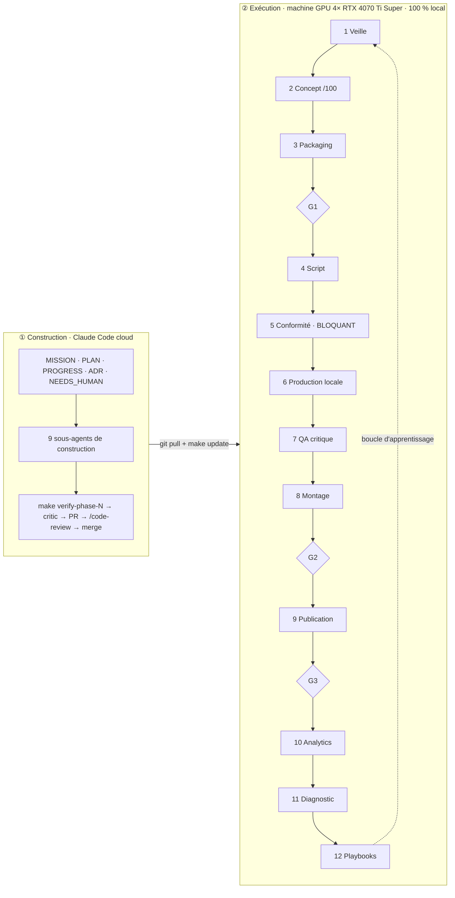

# Décisions d'architecture (ADR)

Format imposé (contrôlé par `make verify-phase-0`) : `## ADR-NNN — Titre`, puis `### Statut`, `### Contexte`,
`### Options`, `### Décision`, `### Conséquences`, `### Coût d'un retour arrière`, `### Sources`.
Les faits externes renvoient aux notes de `docs/research/` sous la forme `note.md [Sn]`.

## Index

| ADR | Sujet | Statut |
|---|---|---|
| ADR-001 | Architecture : deux plans, graphe adressé par contenu, DBOS sur Postgres, un worker par GPU | accepté (révisé le 2026-09-28) |
| ADR-002 | Stratégie fournisseurs : modèles locaux, politique de licences, shortlist du benchmark | accepté |
| ADR-003 | Corrections proposées à MISSION §0, §4, §5, §6, §8 après la phase 0 | proposé (accord humain requis) |
| ADR-004 | Preuve de demande : mesure des outliers par l'API officielle uniquement | accepté |

---

## ADR-001 — Architecture : deux plans, graphe adressé par contenu, DBOS sur Postgres, un worker par GPU

### Statut
Accepté le 2026-09-28 (phase 0). À réexaminer à la fin de la phase 1 si `make e2e-dry` ou les tests de reprise contredisent une hypothèse ci-dessous.

### Contexte
Contraintes qui dimensionnent le système :
1. **Charge faible.** `docs/PARAMETERS.md` : 2 chaînes × (1 long + 3 Shorts) par semaine au lancement ; « des dizaines de chaînes » à terme, soit au plus quelques centaines de vidéos par semaine et quelques milliers de tâches par jour. Une machine d'exécution et une base suffisent ; un système distribué n'apporterait que de la complexité.
2. **Ressources rares : heures GPU, quota Claude, temps humain.** Une relance ne doit jamais repayer un plan déjà généré ni un appel Claude déjà fait (MISSION §6.1).
3. **Matériel fragmenté.** 4 cartes de 16 Go sans NVLink : 4 espaces VRAM indépendants ; charger un modèle coûte des dizaines de secondes ; OOM et blocages sont des cas normaux, pas des exceptions.
4. **Un humain, ≤ 30 min par jour.** Chaque service de plus est un service à surveiller : l'exploitation doit tenir en `make up` / `make update`.
5. **Conformité non contournable.** Une sanction pour spam ou contournement vise le titulaire et peut toucher toutes ses chaînes (`platform-policies.md` [S1]).
6. **Deux environnements.** La VM cloud qui construit n'a pas de GPU ; la machine GPU exécute.
7. **Dépôt public** (NEEDS_HUMAN H1) : ce qui transite par git est public ; les règles de l'API YouTube limitent aussi la conservation des données (`apis.md`).
8. **Aucun orchestrateur du marché ne fournit** l'affinité de modèle en VRAM ni la réservation de budget : ces fonctions sont à écrire quel que soit l'outil (`infra.md` [S1] [S3] [S23]).

Schéma de référence (fourni par l'humain le 2026-09-28) :

### Options
**A. Orchestrateur**

| Option | Pour | Contre |
|---|---|---|
| A1. Service dédié (Temporal, Hatchet, Prefect, Dagster) | reprise, UI et planification fournies | un ou plusieurs services avec état propre à exploiter ; retour arrière élevé pour Temporal et Dagster (`infra.md` [S1] [S3], tableau comparatif) |
| A2. **Bibliothèque d'exécution durable sur Postgres : DBOS Transact (MIT)** | aucun service de plus ; reprise automatique, cron ; files avec routage par processus (`listen_queues`), priorités, partitions, `deduplication_id`, timeouts qui annulent un workflow et ses enfants (`infra.md` [S1] [S2] [S65]) | tables de workflow DBOS en plus de l'index d'artefacts ; contraintes de déterminisme des workflows à respecter ; dépendance à un projet d'éditeur unique |
| A3. File de tâches bibliothèque (Procrastinate, PgQueuer, MIT) | simple, Postgres seul (`infra.md` [S23] [S25]) | priorités et timeouts partiels ; plus de code maison que A2 |
| A4. File Postgres maison (`FOR UPDATE SKIP LOCKED`, baux) | contrôle total | baux, timeouts, déduplication et reprise à écrire et à prouver nous-mêmes : c'est précisément le code où naissent les doubles exécutions |

**B. Stockage des médias** : B1 disque local adressé par hash + index Postgres ; B2 stockage objet S3 local (MinIO exclu : édition libre en fin de vie, dépôt archivé le 25/04/2026, `infra.md` [S30] ; SeaweedFS Apache-2.0 possible, `infra.md` [S35]).

**C. OS de la machine GPU** : C1 Ubuntu 24.04 natif ; C2 Windows + WSL2 (Docker n'y filtre pas un GPU par index, seul `--gpus all` fonctionne : incompatible avec un worker par carte, `infra.md` [S39]).

**D. Où tournent les agents Claude** : D1 `claude -p` sur la machine d'exécution ; D2 routines Claude Code planifiées dans le cloud qui poussent leurs sorties dans le dépôt.

### Décision
1. **Deux plans.** Construction = ce dépôt + CI GitHub Actions (mocks et fixtures seulement, pas de GPU : `infra.md` [S45]). Exécution = machine GPU sous **Ubuntu 24.04 natif** (C1), Docker Compose + NVIDIA Container Toolkit (`infra.md` [S37] [S38]). Mise à jour : `git pull && make update` (build, migrations, redémarrage).
2. **Graphe adressé par contenu.** Chaque vidéo est une cible ; le planificateur déroule le graphe d'étapes (veille → … → publication → analytics). Clé d'une étape = SHA-256 de (entrées canoniques, paramètres, version de l'étape). Si l'artefact existe, l'étape est sautée.
3. **Exécution durable par DBOS (A2).** Une étape = un workflow DBOS mis en file avec `deduplication_id` = clé d'étape, une priorité (finaux avant brouillons ; conformité et scripts avant critique et veille) et un timeout par classe d'étape. Une file par carte (`gpu0` à `gpu3`), une file `cpu`, une file `llm` ; chaque worker n'écoute que sa file (`listen_queues`). Un **répartiteur maison** choisit la file GPU : carte qui a déjà le modèle en VRAM, sinon la moins chargée. `deduplication_id` ne protège qu'à l'intérieur d'une file (`infra.md` [S65]) : le répartiteur prend donc d'abord un **verrou global par clé d'étape** (table `step_claims`, clé primaire = clé d'étape, bail renouvelé par battement) et n'enfile l'étape que s'il l'obtient. Chaque worker a un **identifiant d'exécuteur DBOS unique et stable** (`gpu0` à `gpu3`, `cpu`, `llm`), pour qu'un worker qui redémarre ne reprenne que ses propres workflows ; le mécanisme exact (variable d'environnement de DBOS) sera vérifié par l'essai de phase 1. Plan B derrière la même interface `JobQueue` : file Postgres maison (A4), puis Procrastinate (A3).
4. **Un worker par carte.** 4 services Compose épinglés par `device_ids` (`infra.md` [S38]), chacun avec son instance ComfyUI headless (`--cuda-device`, `--port`, API `/prompt` + websocket, `infra.md` [S40] [S41]) ou un runtime diffusers selon l'adaptateur (ADR-002).
5. **Plafonds réservés atomiquement.** Avant qu'un worker prenne une tâche, le coût estimé est **réservé** par une seule instruction conditionnelle (`UPDATE budgets SET reserved = reserved + :estimation WHERE portée = :p AND spent + reserved + :estimation <= plafond`). Si aucune ligne n'est modifiée, la tâche ne part pas. À la fin, la réservation est soldée par le coût mesuré. Quatre workers ne peuvent donc pas dépasser ensemble un plafond (valeurs dans `docs/COST_MODEL.md`).
6. **Stockage (B1).** Disque local `/var/studio/cas/aa/bbbb…` + index Postgres (hash, type, taille, étape productrice, coût, date, compteur de références). Rétention configurable ; un artefact référencé par le manifeste d'une vidéo en cours ou publiée n'est jamais purgé. Plan B : SeaweedFS derrière la même interface `ArtifactStore`.
7. **Agents Claude (D1).** Chaque agent runtime est un sous-agent versionné dans `studio/.claude/agents/`, appelé par `ClaudeCodeRunner` : `claude -p --output-format json --json-schema <schéma> --model <m> --max-turns <n>` avec des outils autorisés minimaux ; **jamais `--bare`** (ce mode n'utilise pas l'authentification de l'abonnement et la documentation annonce qu'il deviendra le défaut de `-p`, `apis.md`) ; `make doctor` échoue si `ANTHROPIC_API_KEY` existe (elle prendrait le pas sur l'abonnement, `apis.md`). Un gestionnaire de quota mesure l'usage de chaque appel, détecte la limite atteinte, met la file `llm` en pause et reprend à la réinitialisation. Les routines cloud (D2) sont écartées pour l'instant : elles pousseraient idées et scripts dans un dépôt public et dispersent la mesure du quota.
8. **Conformité et portes liées au hash exact.** Chaque décision de porte est un artefact qui porte le hash de ce qu'elle valide : G1 le hash du package, G2 et le verdict `compliance_officer` le hash du rendu final. La publication exige un verdict favorable **et** une décision G2 sur ce même hash. Tout changement du rendu produit un nouveau hash, donc une nouvelle porte. Aucun paramètre ni drapeau ne permet de publier sans ces deux artefacts.
9. **Portes humaines.** Une porte est une étape de classe `human` qui attend un artefact « décision » (agent + humain), produit par l'interface de validation (FastAPI + HTMX, licences MIT et 0BSD, `infra.md` [S55] [S56]). Celle-ci est accessible sur le réseau privé (Tailscale Personal ou WireGuard, `infra.md` [S42]). Notifications par n8n sur le mini-PC (licence Sustainable Use, usage interne autorisé, `infra.md` [S43]).
10. **Observabilité.** Manifeste JSON par vidéo (clés d'artefacts verrouillées, coûts, décisions, versions), logs JSON structurés sans secret, tableau de bord dans la même application FastAPI.
11. **Multi-chaînes.** Une chaîne = un fichier de configuration (bible, langue, voix, style, watchlist) ; aucun code propre à une chaîne.

**Scénarios de panne traités** (chacun devient un test de phase 1) :

| Scénario | Traitement |
|---|---|
| ComfyUI bloqué alors que le processus vit | timeout par classe d'étape (`SetWorkflowTimeout`) **et** chien de garde de progression : sans événement de progression websocket pendant N s, le travail est interrompu (API d'interruption de ComfyUI, sinon arrêt de l'instance). L'annulation DBOS n'agissant qu'entre deux étapes, la relance attend que le verrou d'étape soit libéré ou que son bail expire (tentatives bornées) |
| Même étape envoyée sur deux cartes, ou worker considéré mort mais encore vivant | verrou global par clé d'étape (une seule prise possible, toutes files confondues) ; `deduplication_id` dans chaque file ; écriture d'artefact « premier écrit gagne » (contrainte d'unicité) ; une sortie arrivée en second est jetée et son coût journalisé comme perte |
| Worker qui redémarre | identifiant d'exécuteur propre : il ne reprend que ses workflows, jamais ceux des trois autres cartes encore vivantes |
| Étape non déterministe (appel Claude, diffusion) | aucune hypothèse de rejouabilité : la première sortie validée est **verrouillée** dans le manifeste de la vidéo ; replanifier réutilise les clés verrouillées ; une nouvelle version d'agent n'invalide pas une vidéo en cours sauf demande explicite. Aucune cascade de recalcul GPU, aucune porte humaine repayée |
| Purge de rétention | interdite sur tout artefact référencé par un manifeste actif ou publié (compteur de références) |
| Plafond dépassé par des workers concurrents | réservation atomique (décision 5) |
| Crash avec une réservation de budget ouverte | la réservation porte le bail du verrou d'étape ; un nettoyeur libère les réservations dont le bail a expiré |
| Limite d'usage Claude atteinte | file `llm` en pause, les étapes GPU sans dépendance Claude continuent, reprise à l'heure de réinitialisation détectée |

### Conséquences
- Phase 1 commence par un **essai DBOS** de quelques jours : un test par fonction requise (routage par `listen_queues`, priorité, `deduplication_id`, timeout qui annule les enfants, reprise après arrêt brutal limitée aux workflows de l'exécuteur qui redémarre). Si un test échoue, bascule sur A4 derrière `JobQueue` et nouvel ADR. Les tests du verrou d'étape (deux répartiteurs concurrents, une seule prise) et du nettoyeur de réservations sont écrits dans le même lot.
- Phase 1 écrit ensuite : contrats Pydantic, calcul de clé canonique, `ArtifactStore` (premier écrit gagne), manifeste verrouillé, réservation de budget, répartiteur GPU simulé à 4 workers mock, `ClaudeCodeRunner` + mock, CLI, et les tests des scénarios de panne ci-dessus.
- `ClaudeCodeRunner` a un test de contrat : la version de la CLI est épinglée sur la machine d'exécution, et une mise à jour de version doit passer un test qui vérifie que l'appel utilise l'abonnement (jamais `--bare`, jamais `ANTHROPIC_API_KEY`).
- Les tests d'intégration Postgres tournent en CI dans un conteneur de service ; la VM cloud ne voit jamais de GPU : tout adaptateur a un mock nommé `mock` ; la vérité GPU vient de `make gpu-smoke`.
- Aucune donnée d'analytics ni de chaîne ne transite par le dépôt tant qu'il est public.

### Coût d'un retour arrière
- Orchestrateur : faible à moyen. Les étapes ne dépendent que des interfaces `JobQueue` et `ArtifactStore`. Quitter DBOS fait perdre les workflows en cours, qui sont recréés par replanification sans recalcul, grâce aux clés verrouillées.
- Stockage : faible. Les noms de fichiers sont des hash ; passer à S3 local = nouvelle implémentation d'`ArtifactStore` + copie.
- OS : moyen. Passer à WSL2 casserait l'épinglage par carte ; il faudrait un seul worker multi-GPU.
- Agents dans le cloud : faible. `ClaudeCodeRunner` est derrière une interface ; un backend « routine » s'ajoute par configuration.

### Sources
`infra.md` [S1] [S2] [S3] [S23] [S25] [S30] [S35] [S37] [S38] [S39] [S40] [S41] [S42] [S43] [S45] [S55] [S56] [S65] · `apis.md` (sections « Conséquences d'architecture » et « État de l'usage de claude -p sur abonnement ») · `platform-policies.md` [S1].

Révision du 2026-09-28 après revue `critic` : la version initiale retenait une file maison (A4) en affirmant que le routage par carte et la préemption n'étaient pas confirmés chez DBOS ; la documentation les confirme (`infra.md` [S65]). Contre-revue : verrou global par étape, identifiant d'exécuteur, interruption effective et nettoyage des réservations ajoutés.

---

## ADR-002 — Stratégie fournisseurs : modèles locaux, politique de licences, shortlist du benchmark

### Statut
Accepté le 2026-09-28. La shortlist est une hypothèse : `make bench-models` (phase 3) la confirme ou la remplace par un nouvel ADR.

### Contexte
- Règle dure (MISSION §5) : pixels et sons viennent de modèles à poids ouverts exécutés sur la machine GPU ou de code de rendu ; Claude, via Claude Code, est le seul service distant de création.
- Opérateur en France : une licence qui exclut l'UE est éliminatoire ; l'usage est commercial (monétisation).
- Contrainte matérielle : 16 Go par carte, Ada sm_89 (FP8 natif d'après la note ; FP4 natif documenté seulement pour la 5ᵉ génération de Tensor Cores, `video-image-models.md` [S46]).
- Aucun chiffre de VRAM ou de vitesse n'a été mesuré sur RTX 4070 Ti Super : les chiffres publiés viennent de RTX 4090 ou de GPU de centre de données (`video-image-models.md`, questions ouvertes).

### Options
1. **Un seul modèle vidéo** (Wan 2.2) : simple, mais aucune alternative si un défaut systématique apparaît.
2. **Routeur multi-modèles locaux + rendu procédural majoritaire** : chaque plan va à la technique la moins chère qui atteint la barre de qualité (MISSION §6.6).
3. **Accepter des licences à zone grise** (FLUX.1 [dev], CogVideoX, Hunyuan) pour gagner en qualité : risque juridique sur des revenus et exclusion UE explicite pour Hunyuan.

### Décision
**Option 2**, avec la politique de licences suivante.

| Classe | Règle | Exemples (vérifiés dans les fichiers de licence) |
|---|---|---|
| Acceptée | Apache-2.0, MIT, BSD, CC0, CC-BY (poids et sorties) | Wan 2.2 (`video-image-models.md` [S2][S3]), Qwen-Image / Qwen-Image-Edit, Z-Image, FLUX.1 [schnell], SeedVR2, RIFE ; Qwen3-TTS, Kokoro, Chatterbox, CosyVoice ; faster-whisper, Whisper (`audio-models.md`) |
| Sous condition | licence communautaire à seuil de revenu, sans exclusion territoriale, **et** sans clause de contrôle à distance : acceptée tant que le seuil est loin, avec un suivi dans le registre des modèles | LTX-2 : seuil de 10 M$ compatible, mais la licence permet au concédant de restreindre l'usage à distance, impose la dernière version et interdit de retirer le filigrane (`video-image-models.md` [S7]), ce qui heurte l'épinglage des révisions : hors shortlist tant qu'un avis juridique n'a pas tranché |
| Refusée | non commerciale (NC), exclusion de l'UE, enregistrement obligatoire sous droit étranger avec plafond de trafic, dépendance non commerciale | HunyuanVideo 1.5 / HunyuanImage / FramePack (UE exclue, [S9]) ; FLUX.1 [dev], Kontext [dev], FLUX.2 [dev] (modèle non commercial, [S22][S23]) ; CogVideoX 1.5 ([S18]) ; GIMM-VFI ([S37]) ; InstantID, IP-Adapter-FaceID **et PuLID** (tous dépendent des poids InsightFace `antelopev2`, non commerciaux, [S31] [S32] [S67]) ; F5-TTS, XTTS-v2, Fish-Speech, MusicGen, MMAudio, HunyuanVideo-Foley (`audio-models.md`) |
| Hors règle | poids fermés, même exécutés localement | Topaz et logiciels propriétaires équivalents ; Wan 2.5 / 2.6 / 2.7 / 3.0 (API seulement, [S1][S4]) |

**Shortlist du benchmark** (`video-image-models.md` §8, `audio-models.md`) :
- Vidéo : Wan 2.2 TI2V-5B (référence dense) ; Wan 2.2 I2V-A14B + LoRA de distillation lightx2v (brouillons rapides, finaux avec offload ou multi-GPU) ; une seconde famille pour ne pas dépendre de Wan : Kandinsky 5.0 Lite (MIT / Apache 2.0, [S14]), avec LongCat-Video (MIT, [S12]) en remplaçant. Avant le benchmark, relister les poids Apache 2.0 publiés par Wan-AI depuis juillet 2026 (inventaire incomplet, note corrigée).
- Image : Z-Image Turbo (principal) ; Qwen-Image-Edit (édition, cohérence d'identité).
- Upscaling : SeedVR2 ; interpolation : RIFE.
- Identité (si un personnage récurrent est indispensable) : LoRA de personnage entraînée localement et Qwen-Image-Edit ; jamais PuLID, InstantID ni IP-Adapter-FaceID (dépendance InsightFace non commerciale).
- Voix : Qwen3-TTS (narrateur) ; Chatterbox ou CosyVoice en secours ; Kokoro en secours léger ; contrôle par faster-whisper large-v3.
- Musique : composition procédurale (MIDI + FluidSynth + SoundFonts à licence vérifiée) par défaut ; ACE-Step / YuE / DiffRhythm en complément génératif ; pistes à licence documentée.
- Effets sonores : banques CC0 (Freesound filtré) et Sonniss (licence commerciale libre de droits) ; aucun modèle génératif retenu (tous NC ou exclus).
- Rendu : Blender headless (Cycles OptiX / EEVEE) + assets CC0 (Poly Haven, ambientCG) ; Remotion (gratuit jusqu'à 3 salariés, `infra.md` [S44]) ; ffmpeg + NVENC.
- Marquage : C2PA (c2pa-python, Apache-2.0/MIT) + IPTC `digitalSourceType` (`trainedAlgorithmicMedia`, `compositeSynthetic`) écrits à l'export (`video-image-models.md` [S47][S48][S49]).

**Registre des modèles** (`studio/models.yaml`, phase 1) : pour chaque modèle, révision épinglée (commit Hugging Face), URL et SHA-256 du fichier LICENSE à cette révision, classe de licence, VRAM mesurée, GPU-s par seconde produite mesurés, statut (`candidat`, `retenu`, `écarté` + raison). Un test compare le hash de licence enregistré à celui de la révision épinglée : un changement de licence bloque l'adaptateur.

### Conséquences
- La qualité se gagne par la grammaire de plans (procédural majoritaire, génératif réservé au mouvement vivant) et par la sélection brouillon → final, pas par un modèle unique.
- `make bench-models` mesure pour chaque candidat : VRAM de pointe, GPU-s par seconde produite, taux de défauts bloquants (`visual_critic`), préférence à l'aveugle (≥ 30 votes par série).
- Les visages humains en gros plan restent évités ; s'ils sont indispensables, ils passent par la chaîne identité ci-dessus et une divulgation.

### Coût d'un retour arrière
Faible par modèle : chaque modèle est derrière un adaptateur au contrat commun, et le routeur choisit par configuration. Moyen pour la politique de licences : l'assouplir exigerait un avis juridique et l'accord écrit de l'humain (MISSION §5).

### Sources
`video-image-models.md` [S1] [S2] [S3] [S4] [S7] [S9] [S12] [S14] [S18] [S22] [S23] [S30] [S31] [S32] [S37] [S67] [S46] [S47] [S48] [S49] · `audio-models.md` (synthèse et table des licences) · `infra.md` [S44].

Révision du 2026-09-28 après revue `critic` : PuLID passe en « refusé » (dépendance InsightFace), LTX-2 sort de la shortlist (clauses de contrôle à distance), une seconde famille vidéo entre dans la shortlist.

---

## ADR-003 — Corrections proposées à MISSION §0, §4, §5, §6, §8 après la phase 0

### Statut
Proposé le 2026-09-28. `docs/MISSION.md` reste inchangé tant que l'humain n'a pas validé (NEEDS_HUMAN). En attendant, le code suit la colonne « Correction ».

### Contexte
MISSION §3.6 : une source plus récente et mieux établie l'emporte, et l'écart est noté. La phase 0 a vérifié les affirmations du §4 et relevé les écarts suivants.

### Options
1. Appliquer les corrections dans `docs/MISSION.md` directement : interdit par la mission elle-même (« propose la correction par ADR au lieu de l'appliquer aveuglément »).
2. Tenir les corrections dans cet ADR et `docs/PARAMETERS.md`, faire valider par l'humain, puis ajouter un erratum daté en fin de `docs/MISSION.md`.

### Décision
Option 2. Corrections proposées :

| § | Affirmation de la mission | Constat (source) | Correction |
|---|---|---|---|
| §4 Modèles vidéo | « Wan 2.2 / 2.7 (Apache 2.0) » | seul Wan 2.2 est ouvert ; 2.5 → 3.0 sont fermés (`video-image-models.md` [S1][S4]) | « Wan 2.2 (Apache 2.0) ; les versions ultérieures sont fermées » |
| §4 Modèles vidéo | « LTX-2.x (licence à vérifier) » | licence communautaire, gratuite sous 10 M$ de revenu annuel (`video-image-models.md` [S7]) | classe « sous condition » (ADR-002) |
| §4 Modèles vidéo | « HunyuanVideo 1.5 (… à vérifier) » | licence excluant l'UE, confirmée dans le texte ([S9]) | refusé |
| §4 API YouTube | 100 `videos.insert` et 100 `search.list` par jour, 10 000 unités pour le reste | confirmé ; depuis le 01/06/2026 ces deux méthodes ont leur propre compteur (`apis.md`) | inchangé, précision ajoutée |
| §4 Divulgation | « AI Act art. 50(4) applicable depuis le 02/08/2026 » | confirmé ; le Digital Omnibus (règlement (UE) 2026/1744, en vigueur le 27/07/2026) laisse aux fournisseurs de systèmes génératifs déjà sur le marché jusqu'au 02/12/2026 pour le marquage de l'art. 50(2) (`platform-policies.md` [S30]) | ajouter : marquage C2PA dès la phase 3, au plus tard le 02/12/2026 |
| §0 OS | « Ubuntu 24.04 / Windows + WSL2 » | WSL2 ne permet pas d'épingler un GPU par index (`infra.md` [S39]) | Ubuntu 24.04 natif requis |
| §5 Voix | « portage CUDA attendu » | Qwen3-TTS tourne nativement sur CUDA (transformers / vLLM, Apache-2.0, `audio-models.md`) | tâche = reproduire le timbre du narrateur et mesurer VRAM, vitesse et WER |
| §6 Claude | `--max-turns` | toujours documenté bien qu'absent de `claude --help` v2.1.283 ; `--bare` n'utilise jamais l'abonnement (`apis.md`) | ajouter « ne jamais utiliser `--bare` » |
| §8 Audio | « −14 LUFS ±1 » | aucune page officielle YouTube ou TikTok ne publie de cible ; consensus de praticiens (`audio-models.md`) | garder −14 LUFS ±1 comme cible interne, étiquetée « praticien, confiance moyenne » |
| §4 Monétisation | (absent) | au 01/02/2027 : nouvelles entrées YPP à 8 000 h ou 20 M de vues Shorts ; partage des revenus Shorts réservé aux chaînes à ≥ 10 M de vues Shorts sur 90 jours (blog YouTube du 10/08/2026, `economics.md` [S5]) | les Shorts d'une chaîne neuve servent à la découverte, pas au revenu ; le long format porte l'économie |
| §4 Monétisation TikTok | contenu entièrement IA exclu du Creator Rewards (confiance moyenne) | les conditions officielles ne le mentionnent pas ; seules des sources secondaires le disent (`platform-policies.md` [S18][S27]) | inchangé : aucune dépendance au programme |
| §7 | « aucun scraping contraire aux conditions » | vérifié : les pages YouTube ne sont pas une source légitime de mesure ; l'API officielle l'est (ADR-004) | inchangé |

### Conséquences
- `docs/PARAMETERS.md` passe l'OS à « Ubuntu 24.04 natif » (hypothèse renforcée par une contrainte technique).
- Le concept de chaîne et le calendrier tiennent compte des seuils YPP de 2027 (voir `docs/research/channel-concepts.md`).

### Coût d'un retour arrière
Nul : un erratum se retire ; aucun code ne dépend du texte de la mission.

### Sources
`video-image-models.md` [S1] [S4] [S7] [S9] · `apis.md` · `infra.md` [S39] · `audio-models.md` · `economics.md` [S5] · `platform-policies.md` [S18] [S27] [S30].

---

## ADR-004 — Preuve de demande : mesure des outliers par l'API officielle uniquement

### Statut
Accepté le 2026-09-28.

### Contexte
La phase 0 exige, pour chaque concept de chaîne, au moins 2 outliers récents (vues ≥ 3× la médiane de la chaîne, « à âge comparable » selon MISSION §7). Pendant la recherche, les pages YouTube n'ont pas pu servir de source légitime (blocage anti-robot, conditions d'utilisation qui interdisent l'accès automatisé, `robots.txt` qui interdit `/results`). Les sites de statistiques tiers ont renvoyé 402/403/429 ou n'affichaient que quelques vidéos anciennes (brouillons de recherche, hors dépôt). La première version du vérificateur acceptait une simple URL de vidéo comme preuve : une preuve creuse.

### Options
1. Accepter des preuves indirectes (taille de chaîne, vues cumulées) : ne mesure pas un outlier.
2. Extraire les pages YouTube par script : contraire aux conditions de la plateforme et à MISSION §7 (`scout`) et §12.
3. **API YouTube Data v3 avec une clé en lecture seule** : données publiques, 1 unité de quota par appel, sans `search.list` (100 unités) (`apis.md`).

### Décision
Option 3. `tools/outliers.py` calcule ratio = vues ÷ médiane des 30 vidéos **du même format** de la chaîne **les plus proches en date de publication**, avant et après (âge comparable). Comparer aux seules vidéos antérieures gonflerait le ratio d'une chaîne en croissance, comme le montre un test. Format : Short = ≤ 180 s et lecteur vertical. Pas de ratio pour une vidéo de moins de 7 jours, ni de vidéo aussi jeune dans la base de comparaison. `tools/outliers.py --save` écrit les mesures brutes (vues de la vidéo, identifiants et vues des vidéos de comparaison, date de mesure) dans `docs/research/outliers/*.json`. Le vérificateur ne compte une ligne que si elle correspond à une mesure brute : ratio **recalculé** ≥ 3× sur au moins 10 vidéos de comparaison, mêmes vues et même médiane que le tableau, publication datant de moins de 18 mois. Une ligne tapée à la main ne compte donc pas. Un fichier brut forgé reste possible : `make verify-phase-0-online` re-mesure chaque outlier compté par l'API (tolérance ±25 %, les vues évoluent), et la phase 0 ne se clôt qu'avec ce contrôle en ligne. Le même code sert de base à l'agent `scout` (watchlist → playlists d'uploads).

### Conséquences
- La phase 0 ne peut pas se fermer tant que la clé `YOUTUBE_API_KEY` n'est pas disponible dans l'environnement (NEEDS_HUMAN H0).
- Les concepts sont classés dès maintenant sur les autres critères ; la preuve de demande complétera ou renversera le classement.

### Coût d'un retour arrière
Faible : outil isolé ; le seuil de 18 mois et la fenêtre de 30 vidéos sont des constantes documentées.

### Sources
`apis.md` (quotas, coûts par méthode) · MISSION §2, §7, §12.

Révision du 2026-09-28 après revue `critic` : médiane à âge comparable au lieu des seules vidéos antérieures. Contre-revue : 12 lignes inventées passaient la porte ; preuve désormais adossée aux mesures brutes et à une re-mesure en ligne.
