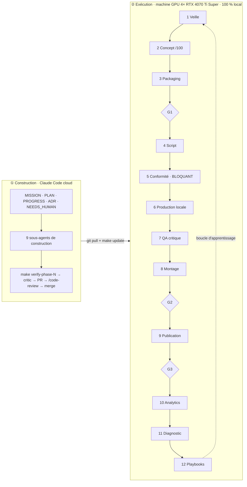

# Décisions d'architecture (ADR)

Format imposé (contrôlé par `make verify-phase-0`) : `## ADR-NNN — Titre`, puis `### Statut`, `### Contexte`,
`### Options`, `### Décision`, `### Conséquences`, `### Coût d'un retour arrière`, `### Sources`.
Les faits externes renvoient aux notes de `docs/research/` sous la forme `note.md [Sn]`.

## Index

| ADR | Sujet | Statut |
|---|---|---|
| ADR-001 | Architecture : deux plans, graphe adressé par contenu, DBOS sur Postgres, un worker par GPU | accepté (révisé le 2026-09-28) |
| ADR-002 | Stratégie fournisseurs : modèles locaux, politique de licences, shortlist du benchmark | accepté |
| ADR-003 | Corrections proposées à MISSION §0, §4, §5, §6, §8 après la phase 0 | proposé (accord humain requis) |
| ADR-004 | Preuve de demande : mesure des outliers par l'API officielle uniquement | accepté |
| ADR-005 | Décisions prises par délégation : concepts A/B, langue, paramètres du §0 | accepté (délégation du 2026-09-28, réversible) |

---

## ADR-001 — Architecture : deux plans, graphe adressé par contenu, DBOS sur Postgres, un worker par GPU

### Statut
Accepté le 2026-09-28 (phase 0), révisé le même jour après revue `critic`. **Révisé le 2026-09-29 à la fin de la phase 1** : l'essai DBOS et le code livré modifient la décision 3 (file de tâches) ; les décisions 12 à 20 consignent ce que la phase 1 a fixé et prouvé, après deux revues `critic` qui ont chacune refusé la phase avant que leurs constats soient corrigés (voir `docs/PROGRESS.md`). Les décisions 1, 2 et 4 à 11 restent en vigueur.

### Contexte
Contraintes qui dimensionnent le système :
1. **Charge faible.** `docs/PARAMETERS.md` : 2 chaînes × (1 long + 3 Shorts) par semaine au lancement ; « des dizaines de chaînes » à terme, soit au plus quelques centaines de vidéos par semaine et quelques milliers de tâches par jour. Une machine d'exécution et une base suffisent ; un système distribué n'apporterait que de la complexité.
2. **Ressources rares : heures GPU, quota Claude, temps humain.** Une relance ne doit jamais repayer un plan déjà généré ni un appel Claude déjà fait (MISSION §6.1).
3. **Matériel fragmenté.** 4 cartes de 16 Go sans NVLink : 4 espaces VRAM indépendants ; charger un modèle coûte des dizaines de secondes ; OOM et blocages sont des cas normaux, pas des exceptions.
4. **Un humain, ≤ 30 min par jour.** Chaque service de plus est un service à surveiller : l'exploitation doit tenir en `make up` / `make update`.
5. **Conformité non contournable.** Une sanction pour spam ou contournement vise le titulaire et peut toucher toutes ses chaînes (`platform-policies.md` [S1]).
6. **Deux environnements.** La VM cloud qui construit n'a pas de GPU ; la machine GPU exécute.
7. **Dépôt public** (NEEDS_HUMAN H1) : ce qui transite par git est public ; les règles de l'API YouTube limitent aussi la conservation des données (`apis.md`).
8. **Aucun orchestrateur du marché ne fournit** l'affinité de modèle en VRAM ni la réservation de budget : ces fonctions sont à écrire quel que soit l'outil (`infra.md` [S1] [S3] [S23]).

Schéma de référence (fourni par l'humain le 2026-09-28) :

### Options
**A. Orchestrateur**

| Option | Pour | Contre |
|---|---|---|
| A1. Service dédié (Temporal, Hatchet, Prefect, Dagster) | reprise, UI et planification fournies | un ou plusieurs services avec état propre à exploiter ; retour arrière élevé pour Temporal et Dagster (`infra.md` [S1] [S3], tableau comparatif) |
| A2. **Bibliothèque d'exécution durable sur Postgres : DBOS Transact (MIT)** | aucun service de plus ; reprise automatique, cron ; files avec routage par processus (`listen_queues`), priorités, partitions, `deduplication_id`, timeouts qui annulent un workflow et ses enfants (`infra.md` [S1] [S2] [S65]) | tables de workflow DBOS en plus de l'index d'artefacts ; contraintes de déterminisme des workflows à respecter ; dépendance à un projet d'éditeur unique |
| A3. File de tâches bibliothèque (Procrastinate, PgQueuer, MIT) | simple, Postgres seul (`infra.md` [S23] [S25]) | priorités et timeouts partiels ; plus de code maison que A2 |
| A4. File Postgres maison (`FOR UPDATE SKIP LOCKED`, baux) | contrôle total | baux, timeouts, déduplication et reprise à écrire et à prouver nous-mêmes : c'est précisément le code où naissent les doubles exécutions |

**B. Stockage des médias** : B1 disque local adressé par hash + index Postgres ; B2 stockage objet S3 local (MinIO exclu : édition libre en fin de vie, dépôt archivé le 25/04/2026, `infra.md` [S30] ; SeaweedFS Apache-2.0 possible, `infra.md` [S35]).

**C. OS de la machine GPU** : C1 Ubuntu 24.04 natif ; C2 Windows + WSL2 (Docker n'y filtre pas un GPU par index, seul `--gpus all` fonctionne : incompatible avec un worker par carte, `infra.md` [S39]).

**D. Où tournent les agents Claude** : D1 `claude -p` sur la machine d'exécution ; D2 routines Claude Code planifiées dans le cloud qui poussent leurs sorties dans le dépôt.

### Décision
1. **Deux plans.** Construction = ce dépôt + CI GitHub Actions (mocks et fixtures seulement, pas de GPU : `infra.md` [S45]). Exécution = machine GPU sous **Ubuntu 24.04 natif** (C1), Docker Compose + NVIDIA Container Toolkit (`infra.md` [S37] [S38]). Mise à jour : `git pull && make update` (build, migrations, redémarrage).
2. **Graphe adressé par contenu.** Chaque vidéo est une cible ; le planificateur déroule le graphe d'étapes (veille → … → publication → analytics). Clé d'une étape = SHA-256 de (entrées canoniques, paramètres, version de l'étape). Si l'artefact existe, l'étape est sautée.
3. **(Révisée par la décision 12 : file tirée maison, DBOS non retenu pour la phase 1.)** **Exécution durable par DBOS (A2).** Une étape = un workflow DBOS mis en file avec `deduplication_id` = clé d'étape, une priorité (finaux avant brouillons ; conformité et scripts avant critique et veille) et un timeout par classe d'étape. Une file par carte (`gpu0` à `gpu3`), une file `cpu`, une file `llm` ; chaque worker n'écoute que sa file (`listen_queues`). Un **répartiteur maison** choisit la file GPU : carte qui a déjà le modèle en VRAM, sinon la moins chargée. `deduplication_id` ne protège qu'à l'intérieur d'une file (`infra.md` [S65]) : le répartiteur prend donc d'abord un **verrou global par clé d'étape** (table `step_claims`, clé primaire = clé d'étape, bail renouvelé par battement) et n'enfile l'étape que s'il l'obtient. Chaque worker a un **identifiant d'exécuteur DBOS unique et stable** (`gpu0` à `gpu3`, `cpu`, `llm`), pour qu'un worker qui redémarre ne reprenne que ses propres workflows ; le mécanisme exact (variable d'environnement de DBOS) sera vérifié par l'essai de phase 1. Plan B derrière la même interface `JobQueue` : file Postgres maison (A4), puis Procrastinate (A3).
4. **Un worker par carte.** 4 services Compose épinglés par `device_ids` (`infra.md` [S38]), chacun avec son instance ComfyUI headless (`--cuda-device`, `--port`, API `/prompt` + websocket, `infra.md` [S40] [S41]) ou un runtime diffusers selon l'adaptateur (ADR-002).
5. **Plafonds réservés atomiquement.** Avant qu'un worker prenne une tâche, le coût estimé est **réservé** par une seule instruction conditionnelle (`UPDATE budgets SET reserved = reserved + :estimation WHERE portée = :p AND spent + reserved + :estimation <= plafond`). Si aucune ligne n'est modifiée, la tâche ne part pas. À la fin, la réservation est soldée par le coût mesuré. Quatre workers ne peuvent donc pas dépasser ensemble un plafond (valeurs dans `docs/COST_MODEL.md`).
6. **Stockage (B1).** Disque local `/var/studio/cas/aa/bbbb…` + index Postgres (hash, type, taille, étape productrice, coût, date, compteur de références). Rétention configurable ; un artefact référencé par le manifeste d'une vidéo en cours ou publiée n'est jamais purgé. Plan B : SeaweedFS derrière la même interface `ArtifactStore`.
7. **Agents Claude (D1).** Chaque agent runtime est un sous-agent versionné dans `studio/.claude/agents/`, appelé par `ClaudeCodeRunner` : `claude -p --output-format json --json-schema <schéma> --model <m> --max-turns <n>` avec des outils autorisés minimaux ; **jamais `--bare`** (ce mode n'utilise pas l'authentification de l'abonnement et la documentation annonce qu'il deviendra le défaut de `-p`, `apis.md`) ; `make doctor` échoue si `ANTHROPIC_API_KEY` existe (elle prendrait le pas sur l'abonnement, `apis.md`). Un gestionnaire de quota mesure l'usage de chaque appel, détecte la limite atteinte, met la file `llm` en pause et reprend à la réinitialisation. Les routines cloud (D2) sont écartées pour l'instant : elles pousseraient idées et scripts dans un dépôt public et dispersent la mesure du quota.
8. **Conformité et portes liées au hash exact.** Chaque décision de porte est un artefact qui porte le hash de ce qu'elle valide : G1 le hash du package, G2 et le verdict `compliance_officer` le hash du rendu final. La publication exige un verdict favorable **et** une décision G2 sur ce même hash. Tout changement du rendu produit un nouveau hash, donc une nouvelle porte. Aucun paramètre ni drapeau ne permet de publier sans ces deux artefacts.
9. **Portes humaines.** Une porte est une étape de classe `human` qui attend un artefact « décision » (agent + humain), produit par l'interface de validation (FastAPI + HTMX, licences MIT et 0BSD, `infra.md` [S55] [S56]). Celle-ci est accessible sur le réseau privé (Tailscale Personal ou WireGuard, `infra.md` [S42]). Notifications par n8n sur le mini-PC (licence Sustainable Use, usage interne autorisé, `infra.md` [S43]).
10. **Observabilité.** Manifeste JSON par vidéo (clés d'artefacts verrouillées, coûts, décisions, versions), logs JSON structurés sans secret, tableau de bord dans la même application FastAPI.
11. **Multi-chaînes.** Une chaîne = un fichier de configuration (bible, langue, voix, style, watchlist) ; aucun code propre à une chaîne.

**Scénarios de panne traités** (chacun devient un test de phase 1) :

| Scénario | Traitement |
|---|---|
| ComfyUI bloqué alors que le processus vit | timeout par classe d'étape (`SetWorkflowTimeout`) **et** chien de garde de progression : sans événement de progression websocket pendant N s, le travail est interrompu (API d'interruption de ComfyUI, sinon arrêt de l'instance). L'annulation DBOS n'agissant qu'entre deux étapes, la relance attend que le verrou d'étape soit libéré ou que son bail expire (tentatives bornées) |
| Même étape envoyée sur deux cartes, ou worker considéré mort mais encore vivant | verrou global par clé d'étape (une seule prise possible, toutes files confondues) ; `deduplication_id` dans chaque file ; écriture d'artefact « premier écrit gagne » (contrainte d'unicité) ; une sortie arrivée en second est jetée et son coût journalisé comme perte |
| Worker qui redémarre | identifiant d'exécuteur propre : il ne reprend que ses workflows, jamais ceux des trois autres cartes encore vivantes |
| Étape non déterministe (appel Claude, diffusion) | aucune hypothèse de rejouabilité : la première sortie validée est **verrouillée** dans le manifeste de la vidéo ; replanifier réutilise les clés verrouillées ; une nouvelle version d'agent n'invalide pas une vidéo en cours sauf demande explicite. Aucune cascade de recalcul GPU, aucune porte humaine repayée |
| Purge de rétention | interdite sur tout artefact référencé par un manifeste actif ou publié (compteur de références) |
| Plafond dépassé par des workers concurrents | réservation atomique (décision 5) |
| Crash avec une réservation de budget ouverte | la réservation porte le bail du verrou d'étape ; un nettoyeur libère les réservations dont le bail a expiré |
| Limite d'usage Claude atteinte | file `llm` en pause, les étapes GPU sans dépendance Claude continuent, reprise à l'heure de réinitialisation détectée |

**Révision de phase 1 (2026-09-29, corrigée après la revue `critic` du même jour).** Chaque point cite le test qui le prouve ; `make verify-phase-1` les exécute tous.

12. **File de tâches : A4 (`SqlJobQueue`) en phase 1, DBOS mis de côté.** L'essai (`docs/design/dbos-spike.md`, DBOS 3.1.0, 19 tests sur vrais processus et Postgres) valide les cinq fonctions exigées : aucun test n'a échoué, la bascule prévue n'est donc pas déclenchée par un échec. Elle est décidée pour quatre raisons.
    - *Deux couches de reprise.* Le graphe se reprend seul : les sorties sont adressées par contenu, une relance saute ce qui existe (`test_replay_with_the_manifest_executes_nothing`), les sorties non déterministes sont verrouillées (`test_non_deterministic_step_is_not_rerun_on_replay_thanks_to_the_manifest`). La reprise de workflow de DBOS double ce mécanisme et peut le contredire après une panne.
    - *Modèle.* DBOS pousse le travail dans le processus qui écoute ; `JobQueue` le tire avec un bail et un jeton de fencing `(executor_id, attempt)`. DBOS n'a ni prise, ni bail, ni battement (`dbos-spike.md`, « Correspondance avec le Protocol `JobQueue` »).
    - *Précautions.* L'essai en livre douze (verrou d'exécuteur, file d'origine à la reprise, `cancel_children`, version d'application, priorité toujours explicite, étape GPU asynchrone…). Un opérateur seul les oublie ; le jeton de fencing d'une file tirée refuse par construction l'écriture d'une exécution périmée (`test_a_dead_executor_cannot_touch_the_job_of_its_replacement`).
    - *Coût déjà payé.* `SqlJobQueue` et `GpuDispatcher` existent, avec la concurrence prouvée sur SQLite et sur Postgres (`test_eight_threads_claiming_one_queue_never_get_the_same_job`, `test_concurrent_workers_complete_every_job_exactly_once_despite_retries`, `test_four_card_workers_never_start_a_draft_while_a_final_waits`).
    `dbos` quitte les dépendances d'exécution et passe dans le groupe `dev`, épinglé `>=3.1,<4`, pour que l'essai reste rejouable. Niveau de confiance : moyen à élevé. Ce qui le ferait changer : une double exécution que le fencing ne couvre pas, ou un besoin de workflows durables à minuteries (fenêtres d'analytics de 48 h, 7 j et 28 j, phase 6) : réexaminer alors DBOS avec le Protocol révisé en deux ports décrit dans `dbos-spike.md`.
    **Limite connue de la phase 1.** La file, le répartiteur GPU et le verrou global par clé d'étape sont des composants prouvés à part, avec des workers mock : le `Runner` exécute ses étapes dans son processus et ne les utilise pas. L'intégration (le `Runner` qui enfile, des workers qui tirent, `step_claims` pris avant chaque étape) arrive en phase 3 avec les vrais workers GPU. D'ici là, l'exclusion entre deux processus est faite au niveau du dossier d'état : un seul `studio run` à la fois (décision 20).
13. **Interfaces telles que livrées** (`studio/core/interfaces.py`) : `JobQueue` tirée (`enqueue`, `claim`, `heartbeat`, `complete`, `fail`, `expire`, `pending`) ; `DispatchableQueue` pour le répartiteur GPU (`claim(..., drafts_blocked_by)`, `queued_counts`, `final_queued`, `release`) ; `CostLedger.renew(reservation_id, lease_until)` ; `ArtifactStore.pinned(owner)` ; `DecisionSource.get(gate, subject_key)`, implémentée par `SqlDecisionStore` ; `StepSpec` porte `mock` (l'étape utilise un adaptateur mock) et `publishes` (l'étape libère quelque chose à l'extérieur) ; une étape peut rendre, en plus de `(octets, type, type MIME)`, ce qu'elle a mesuré elle-même (`{CostKind: quantité}`).
14. **Coûts.** Les quantités sont des entiers en micro-unités (arrondi au plus proche de 10⁻⁶, aucune somme de flottants). Une réservation porte un bail que l'étape renouvelle par battement pendant le calcul (`test_a_running_step_keeps_its_reservations_alive_with_the_heartbeat`) ; sans battement, `reap_expired` la libère (`test_without_a_heartbeat_the_same_slow_step_is_reaped`), et le `Runner` la libère au début de chaque tour pour toute réservation dont le bail est échu (`test_reservations_left_by_a_dead_worker_are_freed_when_a_run_starts`). Le pilote de l'exécution à blanc, seul propriétaire de son dossier, libère toutes celles que laisse un processus tué **tant que `database_url` n'est pas fourni** (la base est alors la SQLite privée `state/studio.db` de son dossier ; `test_repeated_kills_during_gpu_steps_leave_no_reservation_and_the_video_still_finishes`). Sur une base partagée (`DryRunConfig.database_url`), d'autres écrivains sont vivants : il ne libère que les baux échus et jamais la réservation d'un voisin (`test_a_run_on_a_shared_database_leaves_the_live_reservations_of_its_neighbours`, `test_a_run_frees_the_expired_leases_of_a_shared_database`) ; la réservation d'un prédécesseur tué y attend donc l'échéance de son bail (2 h par défaut). Le critère est la présence de `database_url`, pas l'emplacement de la base : une `database_url` qui désigne la SQLite d'un dossier se comporte en base partagée, et la SQLite d'un dossier n'est pas à partager avec un autre dossier (réserve R3, échéance : fin de la phase 2). Une étape GPU déclare une estimation `gpu_seconds > 0` : le graphe refuse sinon, car une réservation nulle passerait un plafond épuisé. Une étape qui échoue est facturée de ce qu'elle a consommé de façon mesurable (secondes GPU écoulées ; un appel Claude, ses secondes et les jetons que son exception rapporte) et le reste est libéré (`test_step_failure_charges_the_measured_gpu_time_and_releases_the_rest`, `test_a_failed_call_charges_the_tokens_its_exception_reports`) ; la tentative compte donc contre le plafond de la relance (`test_a_failed_attempt_counts_against_the_cap_of_the_retry`) et son entrée porte le mode de l'exécution (`test_the_cost_of_a_failed_attempt_carries_the_mode_of_its_run`). Si le registre n'enregistre pas le coût, la sortie n'est pas stockée (`CostNotSettled`, `test_settle_failure_keeps_the_output_out_of_the_store`). **Jetons et durée des appels Claude** (MISSION §6.4) : une étape LLM rend l'usage de l'appel comme mesure (`claude_input_tokens` = tout ce que le modèle a lu, y compris le cache ; `claude_output_tokens`), qui remplace l'estimation (`test_a_step_reports_the_tokens_it_measured_and_they_replace_the_estimate`, `test_the_tokens_of_the_claude_calls_are_recorded_from_their_usage`) ; les estimations de jetons ne servent qu'à dimensionner la réservation, ce sont des repères provisoires jusqu'aux mesures de la phase 2. **Chaque entrée porte `mock`** : la mesure d'un adaptateur mock (des secondes de processeur pour une étape GPU, une réponse scriptée pour un appel Claude) ne se cumule jamais avec une dépense réelle (`test_every_cost_entry_carries_the_mode_of_its_run`, `test_the_costs_file_says_its_figures_measure_mocks_and_each_entry_carries_the_flag`).
15. **Manifeste et clés.** Les sorties sont verrouillées et épinglées (`owner = run_id`). La rétention court depuis le dernier `put`. Un changement de version d'étape garde la vidéo en cours ; `upgrade` nomme les étapes dont le remplacement est demandé (`test_version_bump_keeps_a_locked_video_and_its_gates`, `test_upgrade_replaces_a_locked_output_on_explicit_request`). Le garde de publication (`requires_approval`) s'évalue avant toute réutilisation, verrouillée ou en magasin (`test_publication_guard_is_checked_before_reusing_a_stored_output`, `test_publication_guard_is_checked_before_reusing_a_locked_output`). **Un verrou du manifeste est recoupé avec le magasin** : le manifeste dit ce qui concerne cette vidéo, jamais ce que le magasin contient ; un verrou que le magasin contredit est refusé (`ManifestMismatch`, `test_a_manifest_edited_to_lock_another_output_is_refused`, `test_a_manifest_edited_to_lock_another_render_is_refused`), et un lien perdu par le magasin est rétabli depuis le manifeste tant que l'artefact existe. Les clés des exécutions à blanc et des mocks sont salées : une sortie mock ne sert jamais une exécution réelle (`test_real_run_never_reuses_an_output_of_a_mock_dry_run`). Toute étape de rendu (voix, plan, musique, mixage, assemblage, QA) porte `media_fingerprint()` dans ses paramètres : empreinte de la version de ffmpeg, du cœur libx264, des drapeaux du processeur et de la police d'étiquette, de sorte que deux machines dont l'empreinte diffère ne partagent pas de cache de rendu (`test_every_render_step_carries_the_media_fingerprint`). Le drapeau `-cpuflags` épingle en plus l'encodeur ; ni l'un ni l'autre ne couvre la libm de glibc ni FreeType. Un tour interrompu rend un manifeste partiel (`partial_run(exc)`) que l'appelant persiste : les sorties déjà résolues restent verrouillées (`test_aborted_run_hands_back_a_manifest_that_keeps_pins_in_line`). **Une lecture vérifie ce qu'elle lit.** Le magasin re-hache à chaque lecture tout objet jusqu'à 4 Mio (scripts, décisions, candidats, rapports) : un objet altéré sur place se lit comme absent, il est retiré et l'étape qui le produit se recalcule (`test_a_small_object_that_rotted_in_place_reads_as_missing_and_put_repairs_it`, `test_a_candidate_edited_in_place_is_recomputed_and_never_replayed_as_it_stands`, `test_a_render_rotted_in_place_is_dropped_by_the_read_and_recomputed_never_delivered_as_it_stands`). Les gros objets (rendus, et aussi les WAV de musique et de mixage à partir de 4 Mio) ne sont pas re-hachés à chaque lecture (`test_a_big_object_is_not_re_hashed_on_every_read_but_verify_still_catches_it`) : `verify` les contrôle là où cela compte, à la construction du candidat, à la publication et à la livraison (une entrée de plus de 4 Mio d'une étape qui s'exécute n'est pas encore vérifiée : réserve R4, phase 3), et retire l'objet corrompu pour qu'il soit recalculé (`test_verify_removes_a_corrupt_file_so_that_put_repairs_it`, `test_delivery_refuses_a_rotted_object_and_heals_the_store_so_the_next_run_recomputes_it`). **Un `put` répare un petit objet corrompu de même taille** (`test_putting_the_right_bytes_again_repairs_a_small_object_corrupted_in_place`, `test_the_token_of_a_gate_altered_in_place_is_rewritten_by_the_replay`). **Un contrat qui change de structure change la clé de l'étape qui écrit sous lui** : l'empreinte de la structure des JSON Schemas du contrat de sortie (`contract_fingerprint` : ni titres, ni descriptions, ni exemples, qui viennent des docstrings ; un champ nommé `title` reste de la structure) est un paramètre des étapes `idea`, `package`, `script`, `qa` et `candidate`, et `candidate` et `publish_plan` passent en version 2. Le manifeste garde une vidéo en cours à travers un changement de *version* d'une étape (`test_version_bump_keeps_a_locked_video_and_its_gates`), jamais à travers un changement de ses paramètres : un candidat mis en cache par la version précédente n'est donc pas resservi avec ses approbations, et une phrase changée dans un docstring ne recalcule rien (`test_a_release_that_only_rewords_the_contracts_recomputes_nothing`, `test_the_contract_fingerprint_ignores_documentation_and_sees_structure`, `test_a_field_named_like_a_documentation_keyword_is_structure_not_documentation`). Le prix d'un changement *structurel* est réel : avec le LLM mock, qui répond les mêmes mots à chaque appel, il se réduit à trois appels et aucune seconde de GPU (`test_an_output_cached_under_another_contract_is_recomputed_at_the_price_of_claude_calls_and_no_gpu`) ; avec un vrai LLM, la réponse change et tout ce qui en dépend (voix, plans, portes humaines) suit. Un changement structurel de contrat se déploie donc entre deux vidéos, jusqu'à ce que les étapes LLM gardent une sortie verrouillée qui se valide encore sous le nouveau contrat (réserve R9, échéance : avant les premiers appels Claude réels de la phase 2). Un document d'un contrat plus ancien qui atteindrait quand même une lecture est rapporté en clair par le pilote, sans son contenu, et ne publie rien (`test_a_candidate_of_an_older_contract_that_reaches_the_gates_is_reported_in_words_and_publishes_nothing`, `test_a_contract_error_says_where_and_why_and_never_quotes_the_document`). **Un état écrit par une autre version est refusé en clair** quand ses colonnes diffèrent : les colonnes de chaque table sont comparées à celles que le code déclare (`SchemaMismatch`, `test_a_table_lacking_a_declared_column_is_refused_in_words`, `test_every_backend_of_the_studio_checks_its_tables`, `test_a_state_folder_written_by_another_version_is_reported_in_words_with_exit_code_1`) ; il n'existe pas encore de migration. **Les clés en aval d'une porte sont reproductibles** : la sortie d'une porte est un petit JSON canonique sans date ni note (`test_the_output_of_a_gate_does_not_depend_on_when_it_was_answered`), si bien que deux exécutions neuves de la même vidéo donnent les mêmes clés d'étape (`test_two_fresh_runs_of_the_same_video_give_the_same_keys_and_the_same_bytes`).
16. **Coupure précoce, deux lignes de cache par scène.** Une clé d'étape suit le contenu de ses entrées. Le script produit, par scène, `line_SNN` (texte, ton, durée pour la voix) et `visual_SNN` (prompt visuel, durée pour le plan), sans l'heure de début. Retoucher les mots d'une scène à longueur égale relance une voix, le mixage, l'assemblage, la QA et les portes, sans aucun plan ni musique (`test_editing_the_words_of_one_scene_recomputes_one_voice_and_no_shot`). Les paramètres d'un plan nomment les seuls adaptateurs qui le fabriquent et le jugent : changer de LLM ne relance pas un plan (bug trouvé par ce test).
17. **Portes.** Les décisions vivent dans `SqlDecisionStore` (table `gate_decisions`, clé = porte + hash du sujet ; une décision plus récente sur le même sujet remplace la précédente).
    - *Le sujet des portes de publication est le candidat de publication* (`PublicationCandidate`) : le hash du rendu, le titre, la description, la vie privée, les drapeaux de divulgation, la chaîne, la vidéo, **et les clés du script et du rapport QA que le juge lit**. La conformité et G2 jugent ce candidat. Un titre, une description ou une divulgation changés après l'approbation, le rendu d'une autre vidéo, ou un script dont le bloc `controle` est devenu « non publiable » à rendu, titre et divulgation identiques, forment un autre hash et demandent de nouvelles décisions (`test_a_title_or_a_disclosure_changed_after_the_approvals_needs_new_approvals`, `test_a_script_turned_unpublishable_after_the_approvals_needs_a_new_verdict_and_is_refused`, `test_a_publication_candidate_changes_hash_with_anything_the_platform_will_show`). Le pilote lit le script et le rapport que **le candidat nomme**, jamais ceux que l'exécution tient sous ces noms d'étape (`test_the_officer_reads_the_script_the_candidate_names_not_the_one_the_run_holds_under_that_step_name`).
    - *La conformité exige les deux verdicts* (MISSION §11 : chaque porte enregistre la décision de l'agent et celle de l'humain ; la conformité n'est jamais automatisée). Il faut l'agent `APPROVE` et l'humain `APPROVE` ; l'un ou l'autre `REJECT` bloque, et un humain ne lève pas un refus de l'agent (`test_gate_semantics`, `test_the_compliance_decision_needs_the_agent_and_the_human`). L'humain les donne dans le même geste que G2 (MISSION §11 : G2 couvre « rapports faits et conformité »).
    - *Un refus de l'agent n'est jamais présenté à l'humain* : le pilote répond à la conformité avant G2 et s'arrête au premier refus, sans demander ni la moitié humaine de la conformité ni G2 (`test_the_compliance_officer_blocks_a_script_with_an_open_loop_and_no_human_is_asked_at_g2`).
    - *Le pilote répond pour personne : ses décisions sont toutes mock.* Quel que soit le mode que déclarent le relecteur ou l'officier qu'on lui donne, chaque décision qu'il renvoie porte `mock` ; une décision fusionnée de deux moitiés est mock dès qu'une moitié l'est (`test_every_decision_of_the_autopilot_says_mock_whatever_the_reviewer_and_the_officer_declare`). Une approbation réelle sans humain n'existe donc pas, et elle ne peut pas devenir indélébile (une décision mock ne remplace jamais une réelle).
    - *Attendre n'est pas refuser.* Une décision qui n'approuve ni ne rejette (la moitié humaine encore `PENDING`) arrête la run par `GateWaiting`, code de sortie 4 ; le code 3 reste celui d'un refus (`test_a_decision_still_missing_a_verdict_is_waiting_not_rejected`, `test_a_gate_left_pending_stops_the_run_as_waiting_and_the_answer_that_follows_replaces_it`). Une décision de l'autre mode n'ouvre pas une porte et le pilote le dit sans tourner en boucle (`test_a_real_decision_does_not_open_a_gate_of_a_mock_run_and_the_driver_says_so_at_once`).
    - *Une décision porte son mode.* `GateDecision.mock` marque la décision d'un relecteur mock ; elle ne s'applique qu'à une exécution mock, et une décision réelle qu'à une exécution réelle (`test_a_decision_applies_only_to_a_run_of_its_own_mode`). Une décision mock ne remplace jamais une décision réelle (`test_a_mock_decision_never_replaces_a_real_one`). Le mode d'une exécution est celui que déclare l'appelant, augmenté de celui des étapes : un graphe qui contient une étape mock ne peut pas tourner comme exécution réelle (`test_a_graph_that_holds_a_mock_step_cannot_run_as_a_real_run`) et le pilote dérive ce mode des adaptateurs (`test_the_steps_that_use_a_mock_adapter_are_flagged_so_a_real_run_cannot_contain_them`).
    - *Une porte relit sa décision à chaque tour*, même verrouillée : un refus posé après coup arrête la vidéo, retire le verrou de la porte et celui du plan de publication, et sort en code 3 (`test_a_gate_reads_its_decision_on_every_run_and_a_revoked_approval_stops_the_video`, `test_a_revoked_approval_stops_the_replay_with_a_rejection_and_leaves_no_report`).
    - *Garde structurelle.* Une étape déclarée `publishes` exige, à la construction du graphe, la conformité et G2 sur un même sujet amont, et ce sujet est une étape candidat (`StepSpec.candidate`), jamais un rendu nu : ajouter une étape de publication sans les portes, ou avec des portes sur le seul rendu, échoue (`test_a_publishing_step_must_require_compliance_and_g2_on_one_subject`, `test_the_approvals_of_a_publishing_step_must_bear_on_a_candidate_not_on_a_bare_render`). Limite assumée : la garde vaut pour une étape qui se déclare ; une étape qui publie sans se déclarer passe la construction. **Règle de la phase 5** : le publisher relit lui-même les décisions réelles (conformité et G2) sur le hash exact du candidat qu'il envoie, quoi qu'ait fait le graphe.
    - *La publication vérifie ce qu'elle libère.* `publish_plan` publie le candidat approuvé à l'octet près, refuse un rendu qui a des défauts QA quelle que soit l'approbation (MISSION §8 ; `test_the_publication_plan_refuses_a_render_with_technical_defects_whoever_approved_it`), un candidat qui nomme un autre rendu, un autre script ou un autre rapport QA que ceux qui ont été jugés (`test_the_publication_plan_refuses_a_script_or_a_qa_report_other_than_the_ones_the_judges_read`), un candidat dont les octets ont changé depuis l'approbation (`test_the_publication_plan_refuses_a_candidate_edited_after_the_approval`) et un rendu dont les octets ne correspondent plus à leur hash (`test_the_publication_plan_refuses_a_render_rotted_since_it_was_approved`). La livraison du rendu fait vérifier le hash de l'objet par le magasin (qui le retire s'il est corrompu), puis hache la copie avant de la mettre en place (`test_delivery_copies_verified_bytes_and_leaves_an_identical_file_alone`, `test_delivery_hashes_the_copy_before_it_takes_its_place`).
    - *Ce qui entrera dans le candidat en phases 4 et 5* : tout champ que la plateforme affichera ou que l'API enverra, avant qu'il soit publié : miniatures (image et texte ; `Package.thumbnails` n'est pas encore dans le hash), titres alternatifs de Test & Compare, tags, catégorie, langue audio et sous-titres SRT, playlists, écran de fin, audience « enfants » ; pour TikTok : couverture, duo et collage, contenu de marque. `test_publication_dataclass_is_still_the_contract_the_candidate_wraps` échoue à l'ajout d'un champ : la mise à jour est délibérée.
18. **Quota Claude.** `QuotaExhausted` devient `RunPaused` (code de sortie 75) avec l'heure de reprise ; une relance reprend sans repayer les étapes faites (`test_the_usage_limit_pauses_the_run_and_a_later_run_resumes_it`). La tentative refusée compte pour un appel dans le plafond. La pause est prouvée pour la file de l'exécution à blanc ; « les étapes GPU sans dépendance Claude continuent pendant la pause » n'est pas prouvé en phase 1 (le graphe s'exécute dans l'ordre) et attend l'intégration de la file (décision 12).
19. **Preuve.** `make verify-phase-1` : lint (ruff, mypy strict), suite complète sans test ignoré avec Postgres et ffmpeg exigés, couverture ≥ 80 % sur `studio/domain`, `studio/core`, `studio/scenario`, `studio/pipeline`, puis `make e2e-dry` (Short 1080×1920 et long 1920×1080). **La porte ne croit pas le rapport qu'elle juge** : elle recalcule la durée attendue comme la somme des scènes du script, compte les scènes, mesure elle-même la loudness et la crête vraie avec ffmpeg, compare les longueurs des pistes audio et vidéo, calcule le sha256 du rendu livré, exige `mock` dans chacun des quatre JSON du dossier et sur chaque entrée de coût, et prouve le rejeu par un instantané du contenu de l'état avant et après : un condensat de chaque ligne de chaque table (sauf la date du dernier `put` d'un artefact, que le rejeu d'une porte réécrit) et, pour chaque fichier du magasin, son nom, sa taille, son inode et sa date de modification. Un état effacé puis recalculé aux mêmes lignes laisse d'autres dates et d'autres inodes, que ni un décompte de lignes ni des noms de fichiers ne voient (`test_a_replay_that_wipes_the_state_and_recomputes_it_to_the_same_rows_fails_for_each_format`, `test_the_state_snapshot_sees_a_stored_file_written_again_even_with_the_same_bytes`) ; la porte n'écrit « état inchangé » que s'il l'est (`test_a_replay_that_says_it_executed_nothing_but_changed_the_state_fails_the_gate`) et juge chaque format pour lui-même. Le rejeu est prouvé pour le Short et pour le long, par l'état laissé et non par le rapport (`test_a_second_run_executes_nothing_and_writes_the_same_render`, `test_a_second_run_of_the_long_format_executes_nothing_and_leaves_the_state_untouched`). La crête vraie et la loudness sont deux limites indépendantes (`test_a_render_at_the_right_loudness_whose_true_peak_is_above_the_ceiling_fails`) (`tests/tools/test_verify_phase1.py`). Les tests de bout en bout comparent la durée à un oracle tiré du gabarit du mock, pas du pipeline (`test_the_render_is_a_1080x1920_constant_rate_video_lasting_as_long_as_the_script`).
20. **Un seul processus par dossier d'état ; arrêt brutal.** Un `studio run` prend un verrou exclusif sur `state/.run.lock` (que le noyau relâche à la mort du processus) et refuse de démarrer si un autre tient le dossier (`StateBusy`, `test_a_second_run_on_a_folder_another_process_owns_is_refused_not_run_in_parallel`). Le propriétaire, au démarrage, libère les réservations actives de sa base (décision 14 pour une base partagée), vide `state/tmp` et retire les fichiers JSON à demi écrits d'un prédécesseur tué (`test_a_new_run_removes_the_scratch_files_and_half_written_json_of_a_killed_predecessor_and_nothing_else`) ; il supprime le `report.json` de l'exécution précédente, qui ne décrit donc que la dernière exécution terminée. Prouvé par des arrêts brutaux (`SIGKILL`) pendant une étape GPU, répétés, puis par une reprise complète sans réservation active et sans objet corrompu dans le magasin (`test_a_process_killed_in_the_middle_of_a_run_resumes_without_redoing_finished_steps`, `test_repeated_kills_during_gpu_steps_leave_no_reservation_and_the_video_still_finishes`).

**Scénarios de panne : ce que la phase 1 prouve.** « Composant » : prouvé sur le composant isolé, pas encore branché au `Runner` (décision 12, intégration en phase 3).

| Scénario | Preuve en phase 1 |
|---|---|
| ComfyUI bloqué, processus vivant | composant : bail expiré, tâche re-livrable avec `attempt + 1` (`test_an_expired_job_is_reclaimable_with_attempt_plus_one`) ; chien de garde de progression et interruption de ComfyUI : phase 3 |
| Même étape sur deux cartes | composant : `test_concurrent_enqueues_of_one_key_on_eight_queues_admit_exactly_one` ; magasin : le premier écrit gagne (`test_first_write_wins_between_concurrent_runners` montre que le calcul a lieu deux fois et qu'une seule sortie est retenue, le coût perdu étant journalisé) ; deux `studio run` sur un même dossier : refusés (`StateBusy`) |
| Worker qui redémarre, ou jugé mort mais vivant | composant : `test_a_restarted_worker_with_the_same_id_is_fenced_by_attempt`, `test_a_forged_lease_with_another_executor_is_rejected` |
| Étape non déterministe | `test_non_deterministic_step_is_not_rerun_on_replay_thanks_to_the_manifest` |
| Purge de rétention | `test_purge_spares_pinned_and_recent_and_clears_step_links`, `test_purge_waits_for_every_owner_to_unpin` |
| Plafond dépassé par des workers concurrents | `test_concurrent_reservations_never_exceed_the_cap`, `test_cap_is_never_exceeded_even_by_a_millionth` |
| Crash avec réservation ouverte | bail échu libéré au début du tour (`test_reservations_left_by_a_dead_worker_are_freed_when_a_run_starts`) ; propriétaire du dossier : `test_repeated_kills_during_gpu_steps_leave_no_reservation_and_the_video_still_finishes` ; composant : `test_reap_expired_frees_the_budget_of_a_crashed_worker` |
| Limite d'usage Claude | `test_pause_until_reset_then_automatic_resume`, `test_the_usage_limit_pauses_the_run_and_a_later_run_resumes_it` (pause puis relance ; la poursuite des étapes GPU pendant la pause attend la file) |
| Arrêt brutal du processus | `test_a_process_killed_in_the_middle_of_a_run_resumes_without_redoing_finished_steps` |
| Publication après changement du titre ou de la divulgation | `test_a_title_or_a_disclosure_changed_after_the_approvals_needs_new_approvals` |
| Script devenu non publiable, rendu et titre inchangés | `test_a_script_turned_unpublishable_after_the_approvals_needs_a_new_verdict_and_is_refused` |
| Objet du magasin altéré ou pourri sur place (candidat, rendu) | `test_a_candidate_edited_in_place_is_recomputed_and_never_replayed_as_it_stands`, `test_a_render_rotted_in_place_is_dropped_by_the_read_and_recomputed_never_delivered_as_it_stands` |
| État écrit par une autre version du code | `test_a_state_folder_written_by_another_version_is_reported_in_words_with_exit_code_1` |
| Base partagée : réservation vivante d'un voisin | `test_a_run_on_a_shared_database_leaves_the_live_reservations_of_its_neighbours` |

### Conséquences
- L'**essai DBOS** de la phase 1 est fait (`docs/design/dbos-spike.md`) : aucune des cinq fonctions n'a échoué, et la décision 12 retient pourtant la file tirée maison. Les tests du verrou d'étape (deux répartiteurs concurrents, une seule prise) et du nettoyeur de réservations sont écrits.
- Phase 1 écrit ensuite : contrats Pydantic, calcul de clé canonique, `ArtifactStore` (premier écrit gagne), manifeste verrouillé, réservation de budget, répartiteur GPU simulé à 4 workers mock, `ClaudeCodeRunner` + mock, CLI, et les tests des scénarios de panne ci-dessus.
- `ClaudeCodeRunner` a un test de contrat : la version de la CLI est épinglée sur la machine d'exécution, et une mise à jour de version doit passer un test qui vérifie que l'appel utilise l'abonnement (jamais `--bare`, jamais `ANTHROPIC_API_KEY`).
- Les tests d'intégration Postgres tournent en CI dans un conteneur de service ; la VM cloud ne voit jamais de GPU : tout adaptateur a un mock nommé `mock` ; la vérité GPU vient de `make gpu-smoke`.
- Aucune donnée d'analytics ni de chaîne ne transite par le dépôt tant qu'il est public.

### Coût d'un retour arrière
- Orchestrateur : moyen. Les étapes ne dépendent que des interfaces `JobQueue` et `ArtifactStore`, et une replanification ne recalcule rien grâce aux clés verrouillées. Adopter DBOS plus tard suppose la révision du Protocol en deux ports (répartiteur, garde d'étape) que décrit `dbos-spike.md`, et le respect de ses douze précautions.
- Stockage : faible. Les noms de fichiers sont des hash ; passer à S3 local = nouvelle implémentation d'`ArtifactStore` + copie.
- OS : moyen. Passer à WSL2 casserait l'épinglage par carte ; il faudrait un seul worker multi-GPU.
- Agents dans le cloud : faible. `ClaudeCodeRunner` est derrière une interface ; un backend « routine » s'ajoute par configuration.

### Sources
`infra.md` [S1] [S2] [S3] [S23] [S25] [S30] [S35] [S37] [S38] [S39] [S40] [S41] [S42] [S43] [S45] [S55] [S56] [S65] · `apis.md` (sections « Conséquences d'architecture » et « État de l'usage de claude -p sur abonnement ») · `platform-policies.md` [S1].

`docs/design/dbos-spike.md` (essai DBOS 3.1.0) · `docs/design/phase1.md` (module map et contrat de `make e2e-dry`).

Révision du 2026-09-28 après revue `critic` : la version initiale retenait une file maison (A4) en affirmant que le routage par carte et la préemption n'étaient pas confirmés chez DBOS ; la documentation les confirme (`infra.md` [S65]). Contre-revue : verrou global par étape, identifiant d'exécuteur, interruption effective et nettoyage des réservations ajoutés.

---

## ADR-002 — Stratégie fournisseurs : modèles locaux, politique de licences, shortlist du benchmark

### Statut
Accepté le 2026-09-28. La shortlist est une hypothèse : `make bench-models` (phase 3) la confirme ou la remplace par un nouvel ADR.

### Contexte
- Règle dure (MISSION §5) : pixels et sons viennent de modèles à poids ouverts exécutés sur la machine GPU ou de code de rendu ; Claude, via Claude Code, est le seul service distant de création.
- Opérateur en France : une licence qui exclut l'UE est éliminatoire ; l'usage est commercial (monétisation).
- Contrainte matérielle : 16 Go par carte, Ada sm_89 (FP8 natif d'après la note ; FP4 natif documenté seulement pour la 5ᵉ génération de Tensor Cores, `video-image-models.md` [S46]).
- Aucun chiffre de VRAM ou de vitesse n'a été mesuré sur RTX 4070 Ti Super : les chiffres publiés viennent de RTX 4090 ou de GPU de centre de données (`video-image-models.md`, questions ouvertes).

### Options
1. **Un seul modèle vidéo** (Wan 2.2) : simple, mais aucune alternative si un défaut systématique apparaît.
2. **Routeur multi-modèles locaux + rendu procédural majoritaire** : chaque plan va à la technique la moins chère qui atteint la barre de qualité (MISSION §6.6).
3. **Accepter des licences à zone grise** (FLUX.1 [dev], CogVideoX, Hunyuan) pour gagner en qualité : risque juridique sur des revenus et exclusion UE explicite pour Hunyuan.

### Décision
**Option 2**, avec la politique de licences suivante.

| Classe | Règle | Exemples (vérifiés dans les fichiers de licence) |
|---|---|---|
| Acceptée | Apache-2.0, MIT, BSD, CC0, CC-BY (poids et sorties) | Wan 2.2 (`video-image-models.md` [S2][S3]), Qwen-Image / Qwen-Image-Edit, Z-Image, FLUX.1 [schnell], SeedVR2, RIFE ; Qwen3-TTS, Kokoro, Chatterbox, CosyVoice ; faster-whisper, Whisper (`audio-models.md`) |
| Sous condition | licence communautaire à seuil de revenu, sans exclusion territoriale, **et** sans clause de contrôle à distance : acceptée tant que le seuil est loin, avec un suivi dans le registre des modèles | LTX-2 : seuil de 10 M$ compatible, mais la licence permet au concédant de restreindre l'usage à distance, impose la dernière version et interdit de retirer le filigrane (`video-image-models.md` [S7]), ce qui heurte l'épinglage des révisions : hors shortlist tant qu'un avis juridique n'a pas tranché |
| Refusée | non commerciale (NC), exclusion de l'UE, enregistrement obligatoire sous droit étranger avec plafond de trafic, dépendance non commerciale | HunyuanVideo 1.5 / HunyuanImage / FramePack (UE exclue, [S9]) ; FLUX.1 [dev], Kontext [dev], FLUX.2 [dev] (modèle non commercial, [S22][S23]) ; CogVideoX 1.5 ([S18]) ; GIMM-VFI ([S37]) ; InstantID, IP-Adapter-FaceID **et PuLID** (tous dépendent des poids InsightFace `antelopev2`, non commerciaux, [S31] [S32] [S67]) ; F5-TTS, XTTS-v2, Fish-Speech, MusicGen, MMAudio, HunyuanVideo-Foley (`audio-models.md`) |
| Hors règle | poids fermés, même exécutés localement | Topaz et logiciels propriétaires équivalents ; Wan 2.5 / 2.6 / 2.7 / 3.0 (API seulement, [S1][S4]) |

**Shortlist du benchmark** (`video-image-models.md` §8, `audio-models.md`) :
- Vidéo : Wan 2.2 TI2V-5B (référence dense) ; Wan 2.2 I2V-A14B + LoRA de distillation lightx2v (brouillons rapides, finaux avec offload ou multi-GPU) ; une seconde famille pour ne pas dépendre de Wan : Kandinsky 5.0 Lite (MIT / Apache 2.0, [S14]), avec LongCat-Video (MIT, [S12]) en remplaçant. Avant le benchmark, relister les poids Apache 2.0 publiés par Wan-AI depuis juillet 2026 (inventaire incomplet, note corrigée).
- Image : Z-Image Turbo (principal) ; Qwen-Image-Edit (édition, cohérence d'identité).
- Upscaling : SeedVR2 ; interpolation : RIFE.
- Identité (si un personnage récurrent est indispensable) : LoRA de personnage entraînée localement et Qwen-Image-Edit ; jamais PuLID, InstantID ni IP-Adapter-FaceID (dépendance InsightFace non commerciale).
- Voix : Qwen3-TTS (narrateur) ; Chatterbox ou CosyVoice en secours ; Kokoro en secours léger ; contrôle par faster-whisper large-v3.
- Musique : composition procédurale (MIDI + FluidSynth + SoundFonts à licence vérifiée) par défaut ; ACE-Step / YuE / DiffRhythm en complément génératif ; pistes à licence documentée.
- Effets sonores : banques CC0 (Freesound filtré) et Sonniss (licence commerciale libre de droits) ; aucun modèle génératif retenu (tous NC ou exclus).
- Rendu : Blender headless (Cycles OptiX / EEVEE) + assets CC0 (Poly Haven, ambientCG) ; Remotion (gratuit jusqu'à 3 salariés, `infra.md` [S44]) ; ffmpeg + NVENC.
- Marquage : C2PA (c2pa-python, Apache-2.0/MIT) + IPTC `digitalSourceType` (`trainedAlgorithmicMedia`, `compositeSynthetic`) écrits à l'export (`video-image-models.md` [S47][S48][S49]).

**Registre des modèles** (`studio/models.yaml`, phase 1) : pour chaque modèle, révision épinglée (commit Hugging Face), URL et SHA-256 du fichier LICENSE à cette révision, classe de licence, VRAM mesurée, GPU-s par seconde produite mesurés, statut (`candidat`, `retenu`, `écarté` + raison). Un test compare le hash de licence enregistré à celui de la révision épinglée : un changement de licence bloque l'adaptateur.

### Conséquences
- La qualité se gagne par la grammaire de plans (procédural majoritaire, génératif réservé au mouvement vivant) et par la sélection brouillon → final, pas par un modèle unique.
- `make bench-models` mesure pour chaque candidat : VRAM de pointe, GPU-s par seconde produite, taux de défauts bloquants (`visual_critic`), préférence à l'aveugle (≥ 30 votes par série).
- Les visages humains en gros plan restent évités ; s'ils sont indispensables, ils passent par la chaîne identité ci-dessus et une divulgation.

### Coût d'un retour arrière
Faible par modèle : chaque modèle est derrière un adaptateur au contrat commun, et le routeur choisit par configuration. Moyen pour la politique de licences : l'assouplir exigerait un avis juridique et l'accord écrit de l'humain (MISSION §5).

### Sources
`video-image-models.md` [S1] [S2] [S3] [S4] [S7] [S9] [S12] [S14] [S18] [S22] [S23] [S30] [S31] [S32] [S37] [S67] [S46] [S47] [S48] [S49] · `audio-models.md` (synthèse et table des licences) · `infra.md` [S44].

Révision du 2026-09-28 après revue `critic` : PuLID passe en « refusé » (dépendance InsightFace), LTX-2 sort de la shortlist (clauses de contrôle à distance), une seconde famille vidéo entre dans la shortlist.

---

## ADR-003 — Corrections proposées à MISSION §0, §4, §5, §6, §8 après la phase 0

### Statut
Proposé le 2026-09-28. `docs/MISSION.md` reste inchangé tant que l'humain n'a pas validé (NEEDS_HUMAN). En attendant, le code suit la colonne « Correction ».

### Contexte
MISSION §3.6 : une source plus récente et mieux établie l'emporte, et l'écart est noté. La phase 0 a vérifié les affirmations du §4 et relevé les écarts suivants.

### Options
1. Appliquer les corrections dans `docs/MISSION.md` directement : interdit par la mission elle-même (« propose la correction par ADR au lieu de l'appliquer aveuglément »).
2. Tenir les corrections dans cet ADR et `docs/PARAMETERS.md`, faire valider par l'humain, puis ajouter un erratum daté en fin de `docs/MISSION.md`.

### Décision
Option 2. Corrections proposées :

| § | Affirmation de la mission | Constat (source) | Correction |
|---|---|---|---|
| §4 Modèles vidéo | « Wan 2.2 / 2.7 (Apache 2.0) » | seul Wan 2.2 est ouvert ; 2.5 → 3.0 sont fermés (`video-image-models.md` [S1][S4]) | « Wan 2.2 (Apache 2.0) ; les versions ultérieures sont fermées » |
| §4 Modèles vidéo | « LTX-2.x (licence à vérifier) » | licence communautaire, gratuite sous 10 M$ de revenu annuel (`video-image-models.md` [S7]) | classe « sous condition » (ADR-002) |
| §4 Modèles vidéo | « HunyuanVideo 1.5 (… à vérifier) » | licence excluant l'UE, confirmée dans le texte ([S9]) | refusé |
| §4 API YouTube | 100 `videos.insert` et 100 `search.list` par jour, 10 000 unités pour le reste | confirmé ; depuis le 01/06/2026 ces deux méthodes ont leur propre compteur (`apis.md`) | inchangé, précision ajoutée |
| §4 Divulgation | « AI Act art. 50(4) applicable depuis le 02/08/2026 » | confirmé ; le Digital Omnibus (règlement (UE) 2026/1744, en vigueur le 27/07/2026) laisse aux fournisseurs de systèmes génératifs déjà sur le marché jusqu'au 02/12/2026 pour le marquage de l'art. 50(2) (`platform-policies.md` [S30]) | ajouter : marquage C2PA dès la phase 3, au plus tard le 02/12/2026 |
| §0 OS | « Ubuntu 24.04 / Windows + WSL2 » | WSL2 ne permet pas d'épingler un GPU par index (`infra.md` [S39]) | Ubuntu 24.04 natif requis |
| §5 Voix | « portage CUDA attendu » | Qwen3-TTS tourne nativement sur CUDA (transformers / vLLM, Apache-2.0, `audio-models.md`) | tâche = reproduire le timbre du narrateur et mesurer VRAM, vitesse et WER |
| §6 Claude | `--max-turns` | toujours documenté bien qu'absent de `claude --help` v2.1.283 ; `--bare` n'utilise jamais l'abonnement (`apis.md`) | ajouter « ne jamais utiliser `--bare` » |
| §8 Audio | « −14 LUFS ±1 » | aucune page officielle YouTube ou TikTok ne publie de cible ; consensus de praticiens (`audio-models.md`) | garder −14 LUFS ±1 comme cible interne, étiquetée « praticien, confiance moyenne » |
| §4 Monétisation | (absent) | au 01/02/2027 : nouvelles entrées YPP à 8 000 h ou 20 M de vues Shorts ; partage des revenus Shorts réservé aux chaînes à ≥ 10 M de vues Shorts sur 90 jours (blog YouTube du 10/08/2026, `economics.md` [S5]) | les Shorts d'une chaîne neuve servent à la découverte, pas au revenu ; le long format porte l'économie |
| §4 Monétisation TikTok | contenu entièrement IA exclu du Creator Rewards (confiance moyenne) | les conditions officielles ne le mentionnent pas ; seules des sources secondaires le disent (`platform-policies.md` [S18][S27]) | inchangé : aucune dépendance au programme |
| §7 | « aucun scraping contraire aux conditions » | vérifié : les pages YouTube ne sont pas une source légitime de mesure ; l'API officielle l'est (ADR-004) | inchangé |

### Conséquences
- `docs/PARAMETERS.md` passe l'OS à « Ubuntu 24.04 natif » (hypothèse renforcée par une contrainte technique).
- Le concept de chaîne et le calendrier tiennent compte des seuils YPP de 2027 (voir `docs/research/channel-concepts.md`).

### Coût d'un retour arrière
Nul : un erratum se retire ; aucun code ne dépend du texte de la mission.

### Sources
`video-image-models.md` [S1] [S4] [S7] [S9] · `apis.md` · `infra.md` [S39] · `audio-models.md` · `economics.md` [S5] · `platform-policies.md` [S18] [S27] [S30].

---

## ADR-004 — Preuve de demande : mesure des outliers par l'API officielle uniquement

### Statut
Accepté le 2026-09-28.

### Contexte
La phase 0 exige, pour chaque concept de chaîne, au moins 2 outliers récents (vues ≥ 3× la médiane de la chaîne, « à âge comparable » selon MISSION §7). Pendant la recherche, les pages YouTube n'ont pas pu servir de source légitime (blocage anti-robot, conditions d'utilisation qui interdisent l'accès automatisé, `robots.txt` qui interdit `/results`). Les sites de statistiques tiers ont renvoyé 402/403/429 ou n'affichaient que quelques vidéos anciennes (brouillons de recherche, hors dépôt). La première version du vérificateur acceptait une simple URL de vidéo comme preuve : une preuve creuse.

### Options
1. Accepter des preuves indirectes (taille de chaîne, vues cumulées) : ne mesure pas un outlier.
2. Extraire les pages YouTube par script : contraire aux conditions de la plateforme et à MISSION §7 (`scout`) et §12.
3. **API YouTube Data v3 avec une clé en lecture seule** : données publiques, 1 unité de quota par appel, sans `search.list` (100 unités) (`apis.md`).

### Décision
Option 3. `tools/outliers.py` calcule ratio = vues ÷ médiane des 30 vidéos **du même format** de la chaîne **les plus proches en date de publication**, avant et après (âge comparable). Comparer aux seules vidéos antérieures gonflerait le ratio d'une chaîne en croissance, comme le montre un test. Format : Short = ≤ 180 s et lecteur vertical. Pas de ratio pour une vidéo de moins de 7 jours, ni de vidéo aussi jeune dans la base de comparaison. `tools/outliers.py --save` écrit les mesures brutes (vues de la vidéo, identifiants et vues des vidéos de comparaison, date de mesure) dans `docs/research/outliers/*.json`. Le vérificateur ne compte une ligne que si elle correspond à une mesure brute : ratio **recalculé** ≥ 3× sur au moins 10 vidéos de comparaison, mêmes vues et même médiane que le tableau, publication datant de moins de 18 mois. Une ligne tapée à la main ne compte donc pas. Un fichier brut forgé reste possible : `make verify-phase-0-online` re-mesure chaque outlier compté par l'API (tolérance ±25 %, les vues évoluent), et la phase 0 ne se clôt qu'avec ce contrôle en ligne. Le même code sert de base à l'agent `scout` (watchlist → playlists d'uploads).

### Conséquences
- La phase 0 ne peut pas se fermer tant que la clé `YOUTUBE_API_KEY` n'est pas disponible dans l'environnement (NEEDS_HUMAN H0).
- Les concepts sont classés dès maintenant sur les autres critères ; la preuve de demande complétera ou renversera le classement.

### Coût d'un retour arrière
Faible : outil isolé ; le seuil de 18 mois et la fenêtre de 30 vidéos sont des constantes documentées.

### Sources
`apis.md` (quotas, coûts par méthode) · MISSION §2, §7, §12.

Révision du 2026-09-28 après revue `critic` : médiane à âge comparable au lieu des seules vidéos antérieures. Contre-revue : 12 lignes inventées passaient la porte ; preuve désormais adossée aux mesures brutes et à une re-mesure en ligne.

---

## ADR-005 — Décisions prises par délégation : concepts A/B, langue, paramètres du §0

### Statut
Accepté le 2026-09-28 par délégation : consigne de l'humain « débrouille-toi entièrement seul ». Chaque décision reste réversible ; l'humain peut la renverser à tout moment en modifiant `docs/PARAMETERS.md`.

### Contexte
La mission (§0, §9 phase 0) réservait à l'humain le choix des concepts de chaîne et des paramètres du §0. L'humain délègue désormais ces choix. La preuve de demande mesurée par l'API manque encore (ADR-004, NEEDS_HUMAN H0) : le choix des concepts se fait donc sur les critères disponibles, et il sera réexaminé dès la mesure. Les concepts retenus doivent en outre être distincts entre eux pour le contrôle de diversité inter-chaînes (MISSION §7, §12). Enfin, la décision de langue conditionne la voix, les bibles et les métadonnées de la phase 2, mais ni le squelette ni les contrats de la phase 1.

### Options
1. Attendre l'humain : contraire à la consigne et à MISSION §3.4 (« jamais bloqué par moi »).
2. Retenir les deux premiers concepts du classement (C03 et C11), à 64/80 chacun : l'écart avec les suivants tient dans le bruit de ±3 points (`channel-concepts.md`), et C11 a le risque politique le plus élevé du top 6 ainsi que la concurrence la plus installée.
3. **Fusionner des concepts voisins en deux chaînes distinctes** selon l'adéquation au rendu procédural et la sérialité : « Civilisations reconstruites » (C02 + C07, 63 et 61,5) et « Échelles de l'espace et du temps » (C03 + C09, 64 et 62,5).
4. Langue : français (arbitrage linguistique possible, confiance faible), anglais (audience et RPM des États-Unis environ 2,5 fois ceux de la France selon `economics.md` [S15]), ou une langue par chaîne.

### Décision
- **Chaîne A** = « Civilisations reconstruites » (C02 + C07) : ingénierie historique et villes disparues en 3D, plans larges, reconstitution annoncée.
- **Chaîne B** = « Échelles de l'espace et du temps » (C03 + C09) : échelles impossibles et temps géologique, chaque épisode porté par une question (jamais une suite d'objets alignés : risque de gabarit, `channel-concepts.md` constat 7).
- **Langue maître** = anglais pour les deux chaînes ; piste audio et métadonnées françaises produites par `localizer` (phase 4). Raisons : audience et RPM plus élevés (`economics.md` [S15]) ; une piste secondaire s'ajoute plus tard, alors qu'une audience ne se déplace pas.
- **Autres paramètres du §0** : les hypothèses de `docs/PARAMETERS.md` sont adoptées telles quelles (Max 5x, 30 min par jour, 1 long + 3 Shorts par semaine et par chaîne, Ubuntu 24.04 natif).

### Conséquences
- `docs/PARAMETERS.md` marque ces lignes « délégué (Claude) ». `make verify-phase-0` continue d'exiger la preuve de demande, qui n'est pas levée par la délégation.
- Dès que la clé API est disponible : mesurer les chaînes de C02, C07, C03 et C09 en priorité. Si la mesure renverse le classement, un nouvel ADR remplace celui-ci avant la phase 2.
- Les bibles visuelles des deux chaînes doivent diverger nettement (palette, optique, typographie, musique) : elles partagent la même famille de production.

### Coût d'un retour arrière
Faible jusqu'à la phase 2 : aucun code ne dépend du concept. Moyen ensuite : bibles, `knowledge/` et bancs éditoriaux à refaire pour un nouveau concept.

### Sources
`channel-concepts.md` [S4] [S5] · `economics.md` [S5] [S15] · ADR-004.
